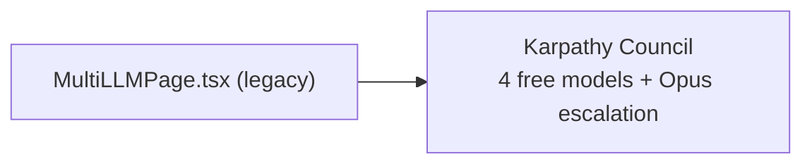

# PRD — Community 214: Multi-LLM Page (Legacy UI)

**Status**: DONE — Legacy frozen  
**Effort**: N/A  
**Date**: 2026-04-16

---

## Master Goal Mapping

| Dimension | Value |
|-----------|-------|
| ALDECI Goal | Karpathy LLM Consensus — UI for viewing multi-model consensus decisions |
| Persona | Security Analyst, AI Engineer |
| Priority | LOW |

---

## Architecture Diagram

---

## Code Proof

| File | Lines | Description |
|------|-------|-------------|
| `suite-ui/aldeci/src/pages/ai-engine/MultiLLMPage.tsx` | L1–3 | Multi-LLM page |

---

## Status

**DONE** — Legacy frozen.
