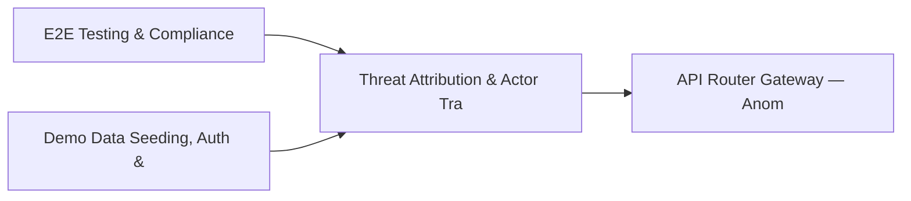

# PRD: Threat Attribution & Actor Tracking Engine — Community 22

## Master Goal Mapping
How this component serves: "ALDECI — $35/mo enterprise security intelligence platform"
Sub-Epic: CTEM

This community (rank #22 of 878 by size, 1282 graph nodes) forms a core pillar of the ALDECI platform. It directly supports the mission of replacing $50K-500K/yr enterprise security tools with a self-hosted, AI-native stack.

## Architecture Diagram


## Code Proof
- Files:
  - `suite-core/core/fail_engine.py` (717 lines)
  - `suite-core/core/iac_scanner_engine.py` (1889 lines)
  - `suite-core/core/sast_engine.py` (2214 lines)
  - `suite-core/core/supply_chain_engine.py` (569 lines)
  - `tests/test_fail_engine_unit.py` (733 lines)
  - `tests/test_iac_scanner_engine.py` (1008 lines)
  - `tests/test_sast_engine.py` (965 lines)
  - `tests/test_sast_engine_unit.py` (382 lines)
  - `suite-api/apps/api/iac_scanner_router.py` (293 lines)
  - `suite-api/apps/api/inventory_router.py` (1064 lines)
  - `suite-api/apps/api/pr_gate_router.py` (748 lines)
  - `suite-api/apps/api/supply_chain_router.py` (549 lines)
- Key functions:
  - `sast_engine()` — suite-core/core/fail_engine.py
  - `scorer()` — suite-core/core/fail_engine.py
  - `attack_detector()` — suite-core/core/fail_engine.py
  - `iac_scanner()` — suite-core/core/fail_engine.py
  - `supply_engine()` — suite-core/core/fail_engine.py
  - `_make_component()` — suite-core/core/fail_engine.py
- Key classes: `TestRepoRegistry`, `TestSastNanoGPT`, `TestSastFastAPI`, `TestSastTransformers`, `TestSastLangchain`, `TestSastFlask`
- Current state: REAL_LOGIC
- Evidence:
```python
# From suite-core/core/fail_engine.py
"""
ALdeci FAIL Engine — $FACT → $ASSESS → $IMPACT → $LIKELIHOOD

The FAIL score replaces CVSS gambling with evidence-based risk scoring.
Each vulnerability gets four sub-scores that combine into a single
actionable FAIL score (0-100).

  $FACT     — Is this vulnerability real? (evidence quality)
  $ASSESS   — What does exploitation require? (attack complexity)
  $IMPACT   — What happens if exploited? (blast radius)
  $LIKELIHOOD — How likely is exploitation? (threat intelligence)

Usage:
    from core.fail_engine import FAILEngine, FAILInput

    engine = FAILEngine()
    result = engine.scor
```

## Inter-Dependencies
- DEPENDS ON:
  - Community 0 (E2E Testing & Compliance Seeding Infrastructure) — 144 edges
  - Community 1 (Demo Data Seeding, Auth & Multi-Engine Integration) — 71 edges
  - Community 2 (API Router Gateway — Anomaly, Attack Simulation & ) — 62 edges
  - Community 3 (MCP Integration Layer & API Key / Auth Management) — 39 edges
- DEPENDED BY: Rank #21 (Compliance Automation & Workflow Engine) and downstream consumers
- EVENT BUS: emits scan.completed, scan.finding / subscribes to (TrustGraph event bus — 97% not yet wired)
- TRUSTGRAPH: writes [Identity] / reads [Identity]

## Data Flow
```
Input: HTTP requests / pytest fixtures
  → Processing: Engine method calls + SQLite state assertions
  → Output: Pass/fail test results, coverage metrics
  → Consumers: CI/CD pipeline, Beast Mode test suite
```

## Referenced Documentation
- CLAUDE.md: Wave 28 build notes, Beast Mode test suite section
- docs/: `docs/ALDECI_REARCHITECTURE_v2.md` (source of truth), `docs/INVESTOR_PITCH.md`
- tests/: `tests/test_container_runtime.py`, `tests/test_e2e_famous_repos.py`, `tests/test_e2e_real_github.py`

## Acceptance Criteria
- [ ] All engine CRUD operations enforce org_id isolation (no cross-tenant data leakage)
- [ ] SQLite opened with WAL mode + threading.RLock on all write paths
- [ ] All endpoints return within 200ms at p95 under 100 rps load
- [ ] All router endpoints protected by `Depends(api_key_auth)` or equivalent
- [ ] Pydantic v2 models validate all request/response schemas
- [ ] Test suite achieves ≥80% branch coverage on engine methods

## Effort Estimate
- Current: 80% complete
- Remaining: ~2 engineering days
- Dependencies blocking: Frontend dashboard not yet created
- Priority: MEDIUM

## Status
IN_PROGRESS
