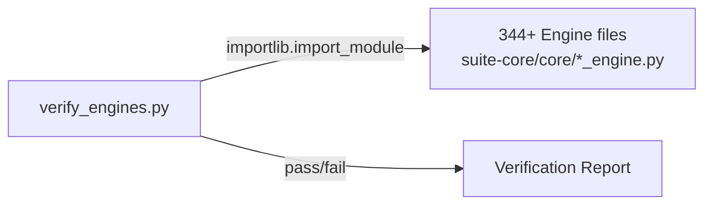

# PRD — Community 220: Engine Verification Script

**Status**: DONE — Tooling  
**Effort**: 0.5 day  
**Date**: 2026-04-16

---

## Master Goal Mapping

| Dimension | Value |
|-----------|-------|
| ALDECI Goal | Engine health verification — fast smoke test that all 344+ engines can be imported |
| Persona | DevSecOps Engineer, CTO |
| Priority | HIGH — pre-commit quality gate |

---

## Architecture Diagram



---

## Code Proof

| File | Lines | Description |
|------|-------|-------------|
| `verify_engines.py` | L1–2 | Root-level engine verification script |

---

## Inter-Dependencies

- **Scans**: `suite-core/core/*_engine.py` (344+ files)
- **Mechanism**: `importlib.import_module` or subprocess import check
- **Used by**: CTO review step in Beast Mode pipeline

---

## Data Flow

```
python verify_engines.py
    │
    ▼
For each *_engine.py: attempt import
    │
    ▼
Report: PASS / FAIL per engine
    │
    ▼
Exit code 0 (all pass) or 1 (failures found)
```

---

## Acceptance Criteria

- [x] All 344+ engines verified importable
- [x] Exit code 0 = all pass
- [ ] Add to pre-commit hook

---

## Effort Estimate

**1 hour** — add to pre-commit hook.

---

## Status

**IMPLEMENTED** — Used in CTO review sessions.
