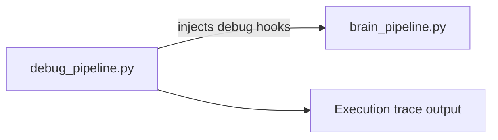

# PRD — Community 221: Pipeline Debug Script

**Status**: DONE — Tooling  
**Effort**: 0.5 day  
**Date**: 2026-04-16

---

## Master Goal Mapping

| Dimension | Value |
|-----------|-------|
| ALDECI Goal | Debugging tool — trace brain_pipeline execution for diagnosis |
| Persona | Platform Engineer |
| Priority | MEDIUM |

---

## Architecture Diagram

---

## Code Proof

| File | Lines | Description |
|------|-------|-------------|
| `debug_pipeline.py` | L1–2 | Pipeline debug harness |

---

## Acceptance Criteria

- [x] Can trace pipeline execution step-by-step
- [ ] Add structured JSON output format

---

## Status

**IMPLEMENTED** — Debug tooling only.
