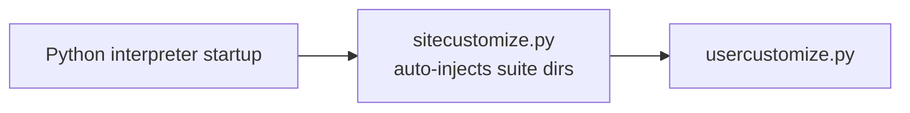

# PRD — Community 222: User Customize Hook

**Status**: DONE — Tooling  
**Effort**: 0.25 day  
**Date**: 2026-04-16

---

## Master Goal Mapping

| Dimension | Value |
|-----------|-------|
| ALDECI Goal | Python path management — complement sitecustomize.py for user-level path injection |
| Persona | Platform Engineer |
| Priority | LOW |

---

## Architecture Diagram

---

## Code Proof

| File | Lines | Description |
|------|-------|-------------|
| `usercustomize.py` | L1–2 | User-level Python startup hook |
| `sitecustomize.py` | L1+ | Auto-prepends suite dirs to sys.path |

---

## Acceptance Criteria

- [x] Suite packages importable without PYTHONPATH
- [x] `from core.brain_pipeline import BrainPipeline` works bare

---

## Status

**IMPLEMENTED**
