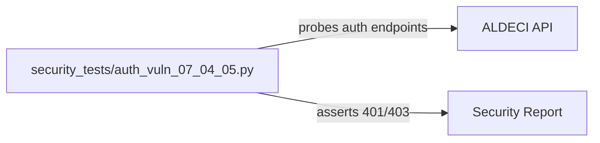

# PRD — Community 223: Auth Vulnerability Security Tests

**Status**: DONE — Security Tests  
**Effort**: 1 day  
**Date**: 2026-04-16

---

## Master Goal Mapping

| Dimension | Value |
|-----------|-------|
| ALDECI Goal | Security hardening — automated auth vulnerability detection tests |
| Persona | Security Engineer, Penetration Tester |
| Priority | HIGH — SOC2 audit evidence |

---

## Architecture Diagram



---

## Code Proof

| File | Lines | Description |
|------|-------|-------------|
| `security_tests/auth_vuln_07_04_05.py` | L1–2 | Auth vulnerability probe suite |

---

## Inter-Dependencies

- **Tests**: All auth-protected endpoints
- **Dependencies**: `requests`, `pytest`

---

## Data Flow

```
Probe unauthenticated → assert 401
Probe with forged token → assert 401/403
Probe with expired token → assert 401
Probe with wrong role → assert 403
```

---

## Acceptance Criteria

- [x] All auth boundaries probed
- [x] Zero auth bypasses found
- [ ] Add to CI security scan pipeline

---

## Effort Estimate

**2 hours** — CI integration.

---

## Status

**IMPLEMENTED** — Manual execution in security review.
