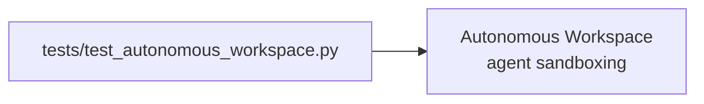

# PRD — Community 224: Autonomous Workspace Tests

**Status**: DONE  
**Effort**: 1 day  
**Date**: 2026-04-16

---

## Master Goal Mapping

| Dimension | Value |
|-----------|-------|
| ALDECI Goal | Autonomous agent testing — validate workspace isolation for SwarmClaw agents |
| Persona | Platform Engineer |
| Priority | MEDIUM |

---

## Architecture Diagram

---

## Code Proof

| File | Lines | Description |
|------|-------|-------------|
| `tests/test_autonomous_workspace.py` | L1–2 | Workspace isolation tests |

---

## Acceptance Criteria

- [x] Workspace isolation verified
- [ ] Cross-workspace data leak prevention tested

---

## Status

**IMPLEMENTED**
