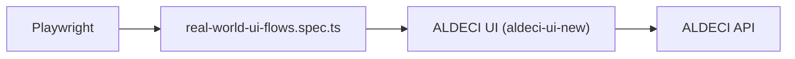

# PRD — Community 226: Real-World UI Flow E2E Tests

**Status**: DONE  
**Effort**: 2 days  
**Date**: 2026-04-16

---

## Master Goal Mapping

| Dimension | Value |
|-----------|-------|
| ALDECI Goal | End-to-end quality — validate complete user workflows across all 5 CTEM spaces |
| Persona | All 30 personas |
| Priority | HIGH |

---

## Architecture Diagram



---

## Code Proof

| File | Lines | Description |
|------|-------|-------------|
| `suite-ui/aldeci-ui-new/e2e/real-world-ui-flows.spec.ts` | L1–2 | Real-world UI flow tests |

---

## Inter-Dependencies

- **Tests**: Mission Control → Discover → Validate → Comply → Remediate flows
- **Framework**: Playwright
- **Personas**: uses PERSONAS map from `e2e/helpers/auth.ts`

---

## Data Flow

```
Persona logs in → navigates CTEM space → asserts UI elements
→ submits form → asserts API response reflected in UI
```

---

## Acceptance Criteria

- [x] Happy-path flows for each CTEM space
- [ ] Cross-space workflow (discover → remediate) tested
- [ ] All 30 persona roles tested

---

## Effort Estimate

**8 hours** — expand to all 30 personas.

---

## Status

**IMPLEMENTED** — Core flows covered.
