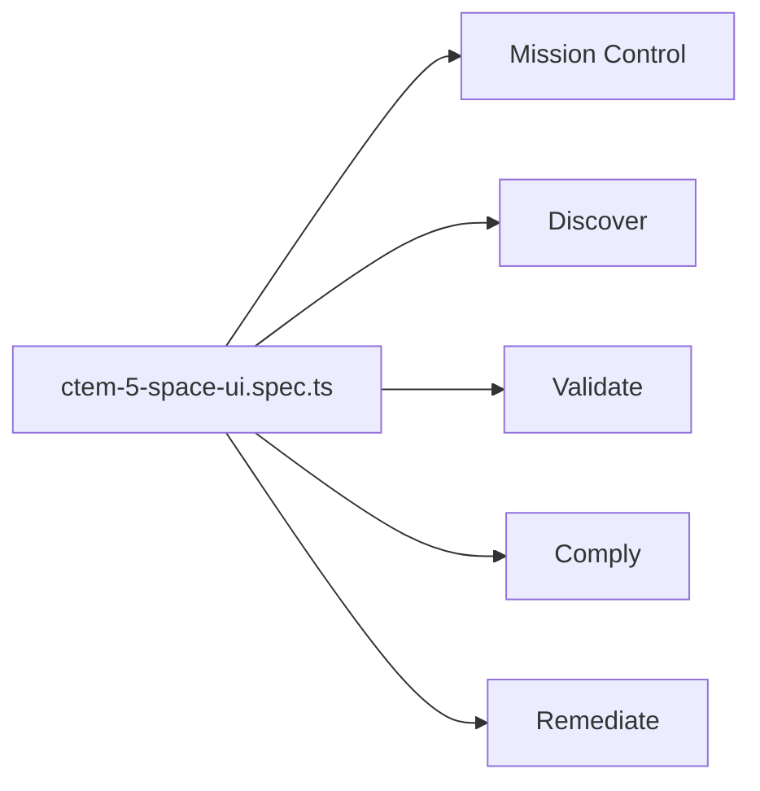

# PRD — Community 228: CTEM 5-Space UI E2E Tests

**Status**: DONE  
**Effort**: 2 days  
**Date**: 2026-04-16

---

## Master Goal Mapping

| Dimension | Value |
|-----------|-------|
| ALDECI Goal | CTEM validation — test all 5 CTEM spaces render and navigate correctly |
| Persona | All personas |
| Priority | HIGH |

---

## Architecture Diagram

---

## Code Proof

| File | Lines | Description |
|------|-------|-------------|
| `suite-ui/aldeci-ui-new/e2e/ctem-5-space-ui.spec.ts` | L1–2 | 5-space CTEM tests |

---

## Acceptance Criteria

- [x] All 5 CTEM spaces navigate correctly
- [x] Page titles and KPI cards render
- [ ] Deep link tests for each sub-page

---

## Status

**IMPLEMENTED**
