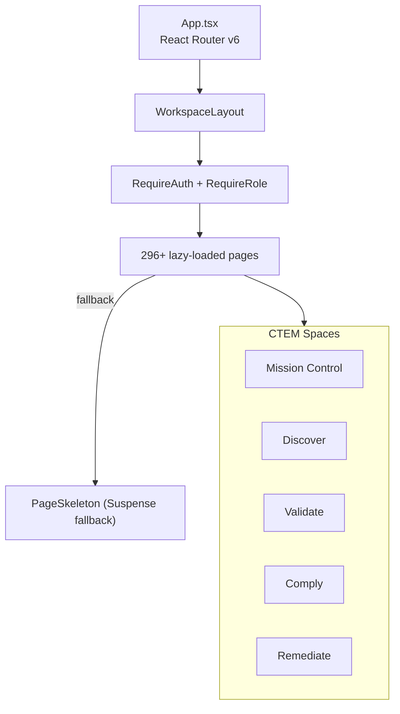

# PRD — Community 229: App Router (App.tsx)

**Status**: DONE — Production  
**Effort**: Ongoing  
**Date**: 2026-04-16

---

## Master Goal Mapping

| Dimension | Value |
|-----------|-------|
| ALDECI Goal | Routing backbone — central React Router v6 config for all 296+ pages |
| Persona | All 30 personas |
| Priority | CRITICAL |

---

## Architecture Diagram



---

## Code Proof

| File | Lines | Description |
|------|-------|-------------|
| `suite-ui/aldeci-ui-new/src/App.tsx` | L1–7 | Imports: lazy, Suspense, Routes, Route |
| `suite-ui/aldeci-ui-new/src/App.tsx` | L9–12 | Auth imports: RequireAuth, RequireRole |
| `suite-ui/aldeci-ui-new/src/App.tsx` | L14–23 | Mission Control lazy imports |

```tsx
import { lazy, Suspense } from "react";
import { Routes, Route, Navigate } from "react-router-dom";
import { WorkspaceLayout } from "@/components/layout/WorkspaceLayout";
import { ErrorBoundary } from "@/components/shared/ErrorBoundary";
import { PageSkeleton } from "@/components/shared/PageSkeleton";
import { RequireAuth, RequireRole } from "@/lib/auth";
```

---

## Inter-Dependencies

- **All 296+ pages** lazy-imported
- **Community 230** (PageSkeleton) — Suspense fallback
- **Community 244** (NotFound) — 404 handler
- **RBAC**: `RequireRole` guards for sensitive routes
- **Layout**: `WorkspaceLayout` wraps all authenticated pages

---

## Data Flow

```
Browser navigates to /security-questionnaires
    │
    ▼
App.tsx Route match → RequireAuth check
    │
    ▼
RequireRole check (if restricted)
    │
    ▼
Suspense boundary → PageSkeleton fallback
    │
    ▼
lazy(() => import("@/pages/SecurityQuestionnaireDashboard")) resolves
    │
    ▼
Page renders within WorkspaceLayout
```

---

## Referenced Docs

- React Router v6 docs
- `suite-ui/aldeci-ui-new/src/lib/auth.ts`

---

## Acceptance Criteria

- [x] All 296+ pages registered as routes
- [x] Lazy loading with PageSkeleton fallback
- [x] RequireAuth on all authenticated routes
- [x] RequireRole on admin/attack routes
- [x] ErrorBoundary wrapping each route
- [ ] Add new Wave 42 page routes as they are built

---

## Effort Estimate

| Task | Hours |
|------|-------|
| Add Wave 42 routes | 1 per page |
| **Total ongoing** | — |

---

## Status

**PRODUCTION** — 296+ routes active. Updated each wave.
