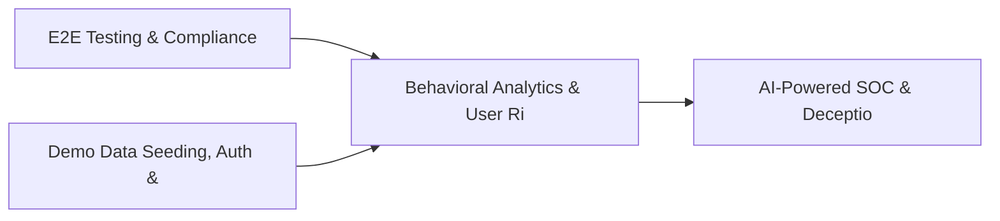

# PRD: Behavioral Analytics & User Risk Profiling — Community 23

## Master Goal Mapping
How this component serves: "ALDECI — $35/mo enterprise security intelligence platform"
Sub-Epic: AI

This community (rank #23 of 878 by size, 1272 graph nodes) forms a core pillar of the ALDECI platform. It directly supports the mission of replacing $50K-500K/yr enterprise security tools with a self-hosted, AI-native stack.

## Architecture Diagram


## Code Proof
- Files:
  - `suite-api/apps/api/analytics_engine_router.py` (164 lines)
  - `suite-api/apps/api/api_security_engine_router.py` (222 lines)
  - `suite-core/core/api_discovery_engine.py` (470 lines)
  - `suite-core/core/api_inventory_engine.py` (336 lines)
  - `suite-core/core/digital_identity_engine.py` (486 lines)
  - `suite-core/core/edr_engine.py` (559 lines)
  - `suite-api/apps/api/ai_orchestrator_router.py` (258 lines)
  - `suite-api/apps/api/analytics_engine_router.py` (164 lines)
  - `suite-api/apps/api/api_abuse_detection_router.py` (196 lines)
  - `suite-api/apps/api/api_analytics_router.py` (98 lines)
  - `suite-api/apps/api/api_discovery_router.py` (213 lines)
  - `suite-api/apps/api/api_gateway_security_router.py` (205 lines)
- Key functions:
  - `test_register_check_basic()` — suite-api/apps/api/analytics_engine_router.py
  - `test_register_check_all_fields()` — suite-api/apps/api/analytics_engine_router.py
  - `test_register_check_missing_name()` — suite-api/apps/api/analytics_engine_router.py
  - `test_register_check_invalid_category()` — suite-api/apps/api/analytics_engine_router.py
  - `test_register_check_invalid_status()` — suite-api/apps/api/analytics_engine_router.py
  - `test_register_all_categories()` — suite-api/apps/api/analytics_engine_router.py
  - `test_register_all_statuses()` — suite-api/apps/api/analytics_engine_router.py
  - `test_update_check_status()` — suite-api/apps/api/analytics_engine_router.py
- Key classes: `TestRegisterEndpoint`, `TestListAndGetEndpoint`, `TestRecordIncident`, `TestListAndUpdateIncident`, `TestAbuseStats`
- Current state: REAL_LOGIC
- Evidence:
```python
# From suite-api/apps/api/analytics_engine_router.py
"""Cross-domain analytics engine API endpoints — ALDECI.

Exposes DuckDB-powered cross-domain analytics over all SQLite domain databases.
Auth is injected by app.py via ``app.include_router(..., dependencies=[...])``.

Prefix: /api/v1/analytics-engine
Tags:   analytics-engine
"""

from __future__ import annotations

from typing import Any, Dict, List, Optional

from fastapi import APIRouter, HTTPException, Query

from core.duckdb_analytics_engine import AnalyticsEngine

router = APIRouter(
    prefix="/api/v1/analytics-engine",
    tags=["analytics-engine"],
```

## Inter-Dependencies
- DEPENDS ON:
  - Community 0 (E2E Testing & Compliance Seeding Infrastructure) — 210 edges
  - Community 1 (Demo Data Seeding, Auth & Multi-Engine Integration) — 37 edges
  - Community 30 (AI-Powered SOC & Deception Analytics Engine) — 34 edges
  - Community 25 (Cloud Workload Protection & Firmware Security) — 14 edges
- DEPENDED BY: Rank #22 (Threat Attribution & Actor Tracking Engine) and downstream consumers
- EVENT BUS: emits incident.opened, incident.closed / subscribes to (TrustGraph event bus — 97% not yet wired)
- TRUSTGRAPH: writes [Vulnerability, Incident, Identity] / reads [Identity, ComplianceControl]

## Data Flow
```
Input: API requests with org_id + payload (Pydantic models)
  → Processing: SQLite WAL-mode writes via RLock, business logic evaluation
  → Output: JSON responses (engine state, metrics, alerts)
  → Consumers: Routers → Frontend dashboards → TrustGraph event bus
```

## Referenced Documentation
- CLAUDE.md: Wave 29 build notes, Beast Mode test suite section
- docs/: `docs/ALDECI_REARCHITECTURE_v2.md` (source of truth), `docs/INVESTOR_PITCH.md`
- tests/: N/A

## Acceptance Criteria
- [ ] All engine CRUD operations enforce org_id isolation (no cross-tenant data leakage)
- [ ] SQLite opened with WAL mode + threading.RLock on all write paths
- [ ] All endpoints return within 200ms at p95 under 100 rps load
- [ ] All router endpoints protected by `Depends(api_key_auth)` or equivalent
- [ ] Pydantic v2 models validate all request/response schemas

## Effort Estimate
- Current: 60% complete
- Remaining: ~5 engineering days
- Dependencies blocking: Frontend dashboard not yet created, Test coverage missing
- Priority: MEDIUM

## Status
IN_PROGRESS
