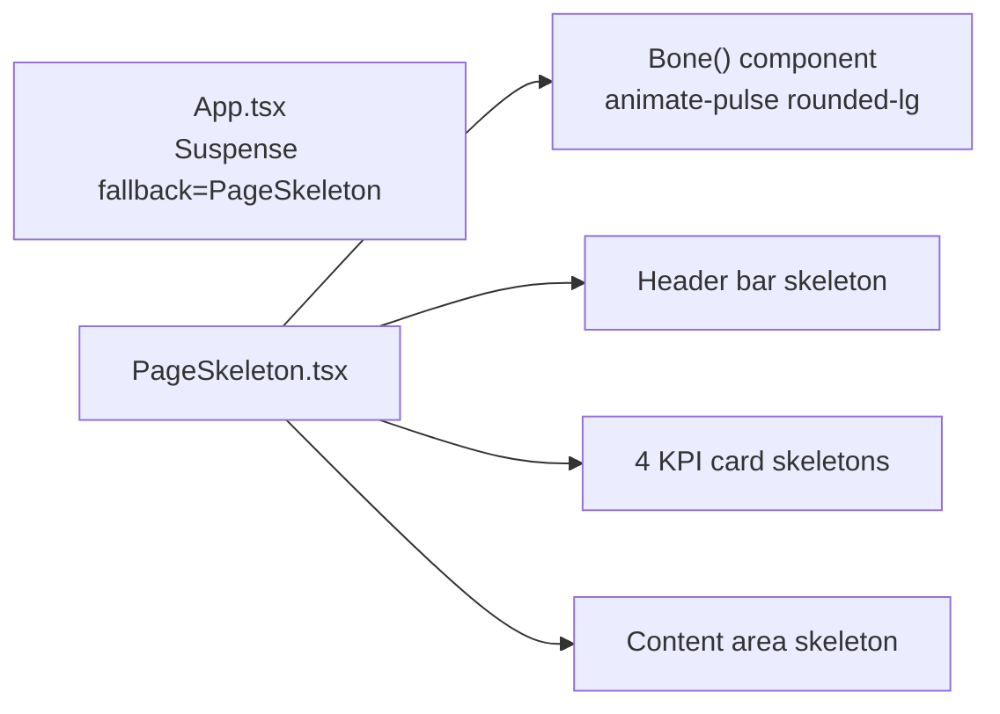

# PRD — Community 230: PageSkeleton Loading Component

**Status**: DONE — Production  
**Effort**: 0.5 day  
**Date**: 2026-04-16

---

## Master Goal Mapping

| Dimension | Value |
|-----------|-------|
| ALDECI Goal | UX quality — animated placeholder shown during lazy-page loading |
| Persona | All personas (perceived performance) |
| Priority | MEDIUM |

---

## Architecture Diagram



---

## Code Proof

| File | Lines | Description |
|------|-------|-------------|
| `suite-ui/aldeci-ui-new/src/components/shared/PageSkeleton.tsx` | L1–2 | Imports cn |
| `suite-ui/aldeci-ui-new/src/components/shared/PageSkeleton.tsx` | L4–10 | `Bone` component — animate-pulse |
| `suite-ui/aldeci-ui-new/src/components/shared/PageSkeleton.tsx` | L12–17 | JSDoc — mirrors header + 4 KPIs + content |

```tsx
function Bone({ className }: { className?: string }) {
  return (
    <div className={cn("animate-pulse rounded-lg bg-muted/60", className)} />
  );
}
```

---

## Inter-Dependencies

- **Used by**: App.tsx Suspense, all lazy routes
- **ARIA**: `aria-busy="true"` + `aria-label="Loading page"` for accessibility

---

## Acceptance Criteria

- [x] Animated pulse skeleton
- [x] Mirrors real layout: header + 4 KPI cards + content
- [x] ARIA accessibility attributes
- [x] Responsive across breakpoints

---

## Status

**PRODUCTION** — Used on all 296+ lazy routes.
