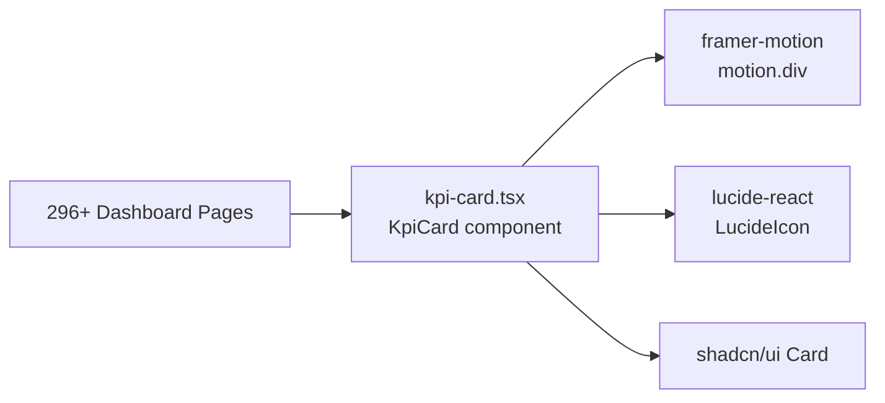

# PRD — Community 231: KPI Card Component

**Status**: DONE — Production  
**Effort**: 1 day  
**Date**: 2026-04-16

---

## Master Goal Mapping

| Dimension | Value |
|-----------|-------|
| ALDECI Goal | Design system — reusable KPI metric card used across all 296+ dashboard pages |
| Persona | All personas |
| Priority | CRITICAL — used in every dashboard |

---

## Architecture Diagram



---

## Code Proof

| File | Lines | Description |
|------|-------|-------------|
| `suite-ui/aldeci-ui-new/src/components/shared/kpi-card.tsx` | L1–6 | Imports |
| `suite-ui/aldeci-ui-new/src/components/shared/kpi-card.tsx` | L8–19 | `KpiCardProps` interface |

```tsx
export interface KpiCardProps {
  title: string;
  value: string | number;
  change?: number;
  changeLabel?: string;
  description?: string;
  icon?: LucideIcon | ReactNode;
  trend?: "up" | "down" | "flat";
  trendLabel?: string;
  className?: string;
  onClick?: () => void;
}
```

---

## Inter-Dependencies

- **Used by**: Every dashboard page (296+ consumers)
- **Dependencies**: framer-motion, lucide-react, shadcn/ui Card, `@/lib/utils` (formatNumber)

---

## Data Flow

```
Dashboard fetches KPI data from API
    │
    ▼
<KpiCard title="Critical Findings" value={87} trend="up" icon={ShieldAlert} />
    │
    ▼
motion.div animates in → renders icon + value + trend indicator
    │
    ▼
trendColor: up=green-400, down=red-400, flat=muted
```

---

## Acceptance Criteria

- [x] Props: title, value, change, changeLabel, description, icon, trend, trendLabel
- [x] Trend colors: green (up), red (down), muted (flat)
- [x] Framer motion animation on mount
- [x] Optional onClick handler
- [x] formatNumber for large values

---

## Status

**PRODUCTION** — Core design system component.
