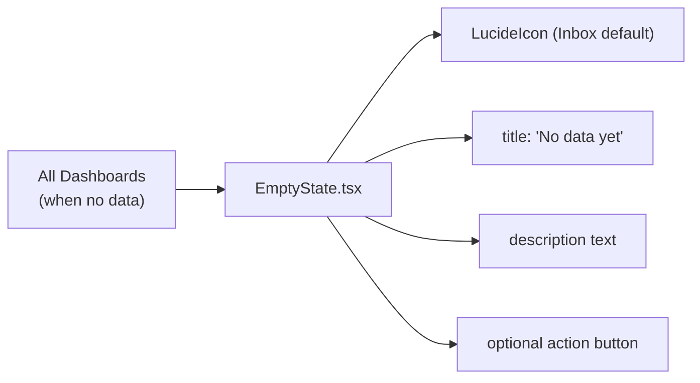

# PRD — Community 232: EmptyState Component

**Status**: DONE — Production  
**Effort**: 0.25 day  
**Date**: 2026-04-16

---

## Master Goal Mapping

| Dimension | Value |
|-----------|-------|
| ALDECI Goal | UX consistency — standardized empty state UI for all tables and lists |
| Persona | All personas |
| Priority | MEDIUM |

---

## Architecture Diagram



---

## Code Proof

| File | Lines | Description |
|------|-------|-------------|
| `suite-ui/aldeci-ui-new/src/components/shared/EmptyState.tsx` | L1 | `import { type LucideIcon, Inbox }` |
| `suite-ui/aldeci-ui-new/src/components/shared/EmptyState.tsx` | L3–8 | Props interface |

```tsx
interface EmptyStateProps {
  icon?: LucideIcon;
  title?: string;           // default: "No data yet"
  description?: string;     // default: "Data will appear here once available."
  action?: React.ReactNode; // optional CTA button
}
```

---

## Acceptance Criteria

- [x] Default icon (Inbox), title, description
- [x] Custom icon, title, description via props
- [x] Optional action button slot
- [x] Centered layout with muted styling

---

## Status

**PRODUCTION**
