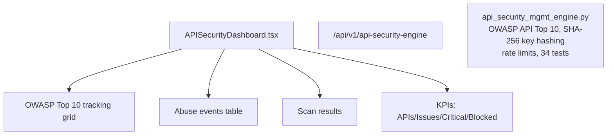

# PRD — Community 235: API Security Dashboard

**Status**: DONE — Production  
**Effort**: 2 days  
**Date**: 2026-04-16

---

## Master Goal Mapping

| Dimension | Value |
|-----------|-------|
| ALDECI Goal | API security posture — OWASP API Top 10 tracking, abuse events, scan results |
| Persona | AppSec Engineer, API Security Analyst |
| Priority | HIGH |
| Route | `/api-security` |
| Backend | `/api/v1/api-security-engine` |

---

## Architecture Diagram

---

## Code Proof

| File | Lines | Description |
|------|-------|-------------|
| `suite-ui/aldeci-ui-new/src/pages/APISecurityDashboard.tsx` | L1–2 | API security dashboard |
| `suite-core/core/api_security_mgmt_engine.py` | (engine) | 34 tests, OWASP coverage |

---

## Inter-Dependencies

- **Backend**: `api_security_mgmt_engine.py` (34 tests) + `api_security_engine_router.py`
- **Also**: `api_abuse_detection_engine.py` (Wave 21, 50 tests)

---

## Acceptance Criteria

- [x] OWASP API Top 10 tracking
- [x] Abuse events table
- [x] SHA-256 API key hashing
- [x] Rate limit monitoring

---

## Status

**IMPLEMENTED** — 34 engine tests passing.
