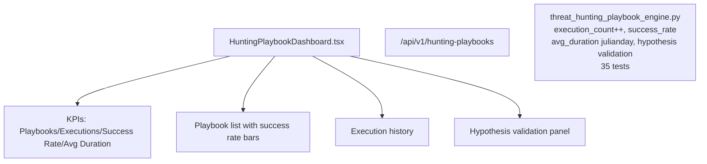

# PRD — Community 236: Hunting Playbook Dashboard

**Status**: DONE — Production  
**Effort**: 2 days  
**Date**: 2026-04-16

---

## Master Goal Mapping

| Dimension | Value |
|-----------|-------|
| ALDECI Goal | Proactive threat hunting — manage and execute hunting playbooks with success rate tracking |
| Persona | Threat Hunter, SOC Analyst |
| Priority | HIGH |
| Route | `/hunting-playbooks` |
| Backend | `/api/v1/hunting-playbooks` |

---

## Architecture Diagram

---

## Code Proof

| File | Lines | Description |
|------|-------|-------------|
| `suite-ui/aldeci-ui-new/src/pages/HuntingPlaybookDashboard.tsx` | L1–2 | Hunting playbook dashboard |
| `suite-core/core/threat_hunting_playbook_engine.py` | (engine) | 35 tests |

---

## Acceptance Criteria

- [x] Playbook list with success_rate bars
- [x] execution_count increment on each run
- [x] avg_duration computed via julianday
- [x] Hypothesis validation panel

---

## Status

**IMPLEMENTED** — 35 engine tests passing.
