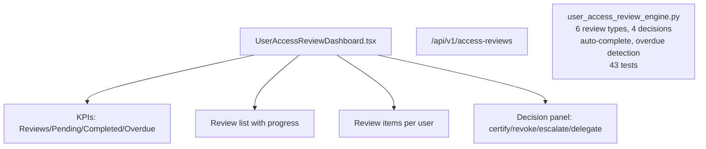

# PRD — Community 237: User Access Review Dashboard

**Status**: DONE — Production  
**Effort**: 2 days  
**Date**: 2026-04-16

---

## Master Goal Mapping

| Dimension | Value |
|-----------|-------|
| ALDECI Goal | Identity governance — systematic user access reviews with 4-decision workflow |
| Persona | IAM Administrator, Compliance Officer |
| Priority | HIGH |
| Route | `/access-reviews` |
| Backend | `/api/v1/access-reviews` |

---

## Architecture Diagram

---

## Code Proof

| File | Lines | Description |
|------|-------|-------------|
| `suite-ui/aldeci-ui-new/src/pages/UserAccessReviewDashboard.tsx` | L1–2 | Access review dashboard |
| `suite-core/core/user_access_review_engine.py` | (engine) | 43 tests |

---

## Acceptance Criteria

- [x] 6 review types
- [x] 4 decisions: certify / revoke / escalate / delegate
- [x] Auto-complete when all items decided
- [x] Overdue detection

---

## Status

**IMPLEMENTED** — 43 engine tests passing.
