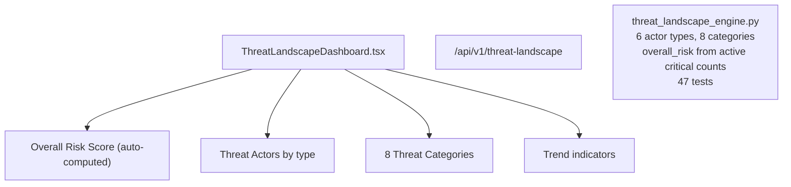

# PRD — Community 238: Threat Landscape Dashboard

**Status**: DONE — Production  
**Effort**: 2 days  
**Date**: 2026-04-16

---

## Master Goal Mapping

| Dimension | Value |
|-----------|-------|
| ALDECI Goal | Strategic threat awareness — overall threat landscape with actor types and categories |
| Persona | CISO, Threat Intel Analyst |
| Priority | HIGH |
| Route | `/threat-landscape` |
| Backend | `/api/v1/threat-landscape` |

---

## Architecture Diagram

---

## Acceptance Criteria

- [x] 6 threat actor types
- [x] 8 threat categories
- [x] overall_risk auto-computed from active critical counts
- [x] Actor/threat counts auto-populated

---

## Status

**IMPLEMENTED** — 47 engine tests passing.
