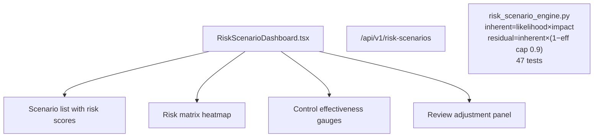

# PRD — Community 239: Risk Scenario Dashboard

**Status**: DONE — Production  
**Effort**: 2 days  
**Date**: 2026-04-16

---

## Master Goal Mapping

| Dimension | Value |
|-----------|-------|
| ALDECI Goal | Risk quantification — FAIR-style risk scenario modeling with inherent/residual risk |
| Persona | Risk Manager, CISO |
| Priority | HIGH |
| Route | `/risk-scenarios` |
| Backend | `/api/v1/risk-scenarios` |

---

## Architecture Diagram

---

## Acceptance Criteria

- [x] inherent_risk = likelihood × impact
- [x] residual = inherent × (1 − effectiveness), effectiveness capped at 0.9
- [x] Review adjustments recompute all scenarios

---

## Status

**IMPLEMENTED** — 47 engine tests passing.
