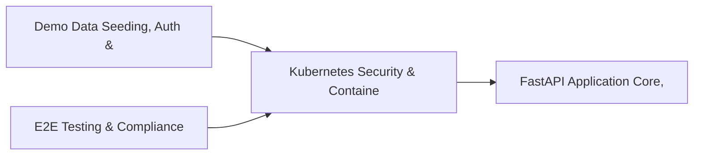

# PRD: Kubernetes Security & Container Registry Engine — Community 24

## Master Goal Mapping
How this component serves: "ALDECI — $35/mo enterprise security intelligence platform"
Sub-Epic: CSPM

This community (rank #24 of 878 by size, 1242 graph nodes) forms a core pillar of the ALDECI platform. It directly supports the mission of replacing $50K-500K/yr enterprise security tools with a self-hosted, AI-native stack.

## Architecture Diagram


## Code Proof
- Files:
  - `tests/test_dlp_engine.py` (603 lines)
  - `tests/test_firewall_rule_engine.py` (410 lines)
  - `suite-core/simulations/experiments/ide/vscode/extension/src/diagnosticManager.ts` (115 lines)
  - `suite-core/simulations/experiments/ide/vscode/extension/src/extension.ts` (160 lines)
  - `suite-core/simulations/experiments/ide/vscode/extension/src/fixopsClient.ts` (160 lines)
  - `suite-ui/aldeci-ui-new/e2e/helpers/auth.ts` (112 lines)
  - `suite-ui/aldeci-ui-new/e2e/persona-api-workflows.spec.ts` (116 lines)
  - `suite-ui/aldeci-ui-new/src/__tests__/setup.ts` (67 lines)
  - `suite-ui/aldeci-ui-new/src/api/client.ts` (290 lines)
  - `suite-ui/aldeci-ui-new/src/components/layout/CopilotSidebar.tsx` (200 lines)
  - `scripts/_test_train.py` (152 lines)
  - `tests/test_ai_orchestrator.py` (664 lines)
- Key functions:
  - `step1_listReports()` — tests/test_dlp_engine.py
  - `step2_createReport()` — tests/test_dlp_engine.py
  - `step4_getReportFile()` — tests/test_dlp_engine.py
  - `checkPayloadUnescaped()` — tests/test_dlp_engine.py
  - `testPayload()` — tests/test_dlp_engine.py
  - `main()` — tests/test_dlp_engine.py
  - `injectStyles()` — tests/test_dlp_engine.py
  - `buildUI()` — tests/test_dlp_engine.py
- Key classes: N/A
- Current state: REAL_LOGIC
- Evidence:
```python
# From tests/test_dlp_engine.py
"""
Tests for the DLP Engine — PII, PCI, credential detection and redaction.

22+ tests covering:
- Basic scan_text contract
- Credit card, SSN, email, AWS key detection
- Clean text (zero findings)
- Risk level values
- Redaction behaviour
- Storage/retrieval
- Filtering by risk level
- Stats aggregation
- Custom patterns
- Privacy guarantee (no raw match values stored)
"""

import sys
sys.path.insert(0, "suite-core")

import pytest
```

## Inter-Dependencies
- DEPENDS ON:
  - Community 1 (Demo Data Seeding, Auth & Multi-Engine Integration) — 100 edges
  - Community 0 (E2E Testing & Compliance Seeding Infrastructure) — 31 edges
  - Community 4 (FastAPI Application Core, Feedback & Smoke Testing) — 14 edges
  - Community 37 (Alert Triage, Enrichment & Priority Queue Engine) — 12 edges
- DEPENDED BY: Rank #23 (Behavioral Analytics & User Risk Profiling) and downstream consumers
- EVENT BUS: emits compliance.status_changed, scan.completed, scan.finding / subscribes to (TrustGraph event bus — 97% not yet wired)
- TRUSTGRAPH: writes [Vulnerability, Policy, ComplianceControl] / reads [Policy, ComplianceControl]

## Data Flow
```
Input: HTTP requests / pytest fixtures
  → Processing: Engine method calls + SQLite state assertions
  → Output: Pass/fail test results, coverage metrics
  → Consumers: CI/CD pipeline, Beast Mode test suite
```

## Referenced Documentation
- CLAUDE.md: Wave 30 build notes, Beast Mode test suite section
- docs/: `docs/ALDECI_REARCHITECTURE_v2.md` (source of truth), `docs/INVESTOR_PITCH.md`
- tests/: `scripts/_test_train.py`, `tests/test_ai_orchestrator.py`, `tests/test_dlp_engine.py`

## Acceptance Criteria
- [ ] All engine CRUD operations enforce org_id isolation (no cross-tenant data leakage)
- [ ] SQLite opened with WAL mode + threading.RLock on all write paths
- [ ] All endpoints return within 200ms at p95 under 100 rps load
- [ ] Test suite achieves ≥80% branch coverage on engine methods
- [ ] All tests pass with `pytest --timeout=10 -q` in <30 seconds
- [ ] Dashboard renders without errors in React 19 + Vite 6 + Tailwind v4

## Effort Estimate
- Current: 75% complete
- Remaining: ~5 engineering days
- Dependencies blocking: Router not yet wired to app.py
- Priority: MEDIUM

## Status
IN_PROGRESS
