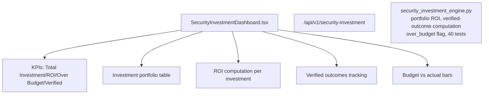

# PRD — Community 240: Security Investment Dashboard

**Status**: DONE — Production  
**Effort**: 2 days  
**Date**: 2026-04-16

---

## Master Goal Mapping

| Dimension | Value |
|-----------|-------|
| ALDECI Goal | Security ROI — track security investments, portfolio ROI, and verified outcomes |
| Persona | CISO, CFO, Security Executive |
| Priority | HIGH |
| Route | `/security-investment` |
| Backend | `/api/v1/security-investment` |

---

## Architecture Diagram



---

## Code Proof

| File | Lines | Description |
|------|-------|-------------|
| `suite-ui/aldeci-ui-new/src/pages/SecurityInvestmentDashboard.tsx` | L1–2 | Investment dashboard |
| `suite-core/core/security_investment_engine.py` | (engine) | 40 tests |

---

## Inter-Dependencies

- **Backend**: `security_investment_engine.py` (40 tests)
- **Router**: `/api/v1/security-investment`
- **over_budget flag**: actual_spend > budget

---

## Data Flow

```
GET /api/v1/security-investment/portfolio → investment list
ROI = (verified_outcomes_value - total_cost) / total_cost * 100
over_budget = actual_spend > budget
```

---

## Acceptance Criteria

- [x] Portfolio ROI computation
- [x] Verified outcome tracking
- [x] Over-budget flag and alert
- [x] Budget vs actual visualization

---

## Status

**IMPLEMENTED** — 40 engine tests passing.
