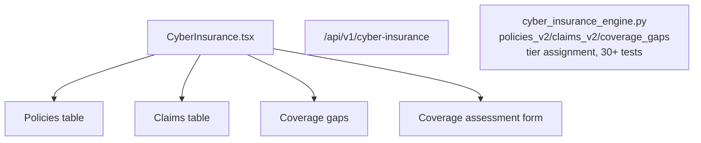

# PRD — Community 241: Cyber Insurance Dashboard

**Status**: DONE — Production  
**Effort**: 2 days  
**Date**: 2026-04-16

---

## Master Goal Mapping

| Dimension | Value |
|-----------|-------|
| ALDECI Goal | Insurance management — track cyber insurance policies, claims, coverage gaps, and tier assignment |
| Persona | CISO, CFO, Risk Manager |
| Priority | MEDIUM |
| Route | `/cyber-insurance` |
| Backend | `/api/v1/cyber-insurance` |

---

## Architecture Diagram

---

## Code Proof

| File | Lines | Description |
|------|-------|-------------|
| `suite-ui/aldeci-ui-new/src/pages/CyberInsurance.tsx` | L1–2 | Cyber insurance dashboard |
| `suite-core/core/cyber_insurance_engine.py` | (engine) | 30+ tests |

---

## Acceptance Criteria

- [x] Policies table with tier badges
- [x] Claims lifecycle tracking
- [x] Coverage gap assessment
- [x] _v2_initialized instance var (not class var) for test isolation

---

## Status

**IMPLEMENTED** — 30+ engine tests passing.
