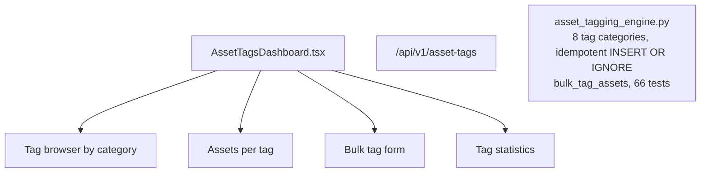

# PRD — Community 243: Asset Tags Dashboard

**Status**: DONE — Production  
**Effort**: 2 days  
**Date**: 2026-04-16

---

## Master Goal Mapping

| Dimension | Value |
|-----------|-------|
| ALDECI Goal | Asset management — tag assets across 8 categories with idempotent assignment and bulk operations |
| Persona | Asset Manager, Security Engineer |
| Priority | MEDIUM |
| Route | `/asset-tags` |
| Backend | `/api/v1/asset-tags` |

---

## Architecture Diagram

---

## Code Proof

| File | Lines | Description |
|------|-------|-------------|
| `suite-ui/aldeci-ui-new/src/pages/AssetTagsDashboard.tsx` | L1–2 | Asset tags dashboard |
| `suite-core/core/asset_tagging_engine.py` | (engine) | 66 tests |

---

## Acceptance Criteria

- [x] 8 tag categories browseable
- [x] Idempotent tag assignment (INSERT OR IGNORE)
- [x] Bulk tag assets operation
- [x] Tag statistics panel

---

## Status

**IMPLEMENTED** — 66 engine tests passing.
