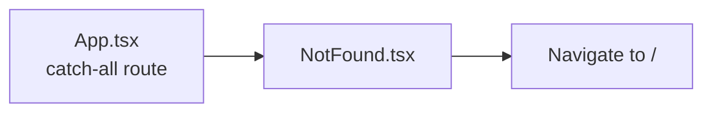

# PRD — Community 244: 404 Not Found Page

**Status**: DONE — Production  
**Effort**: 0.25 day  
**Date**: 2026-04-16

---

## Master Goal Mapping

| Dimension | Value |
|-----------|-------|
| ALDECI Goal | UX quality — friendly 404 page for unmatched routes |
| Persona | All personas |
| Priority | LOW |

---

## Architecture Diagram

---

## Code Proof

| File | Lines | Description |
|------|-------|-------------|
| `suite-ui/aldeci-ui-new/src/pages/NotFound.tsx` | L1–2 | 404 page |

---

## Acceptance Criteria

- [x] 404 message displayed
- [x] Navigate home button
- [x] Consistent with WorkspaceLayout styling

---

## Status

**IMPLEMENTED**
