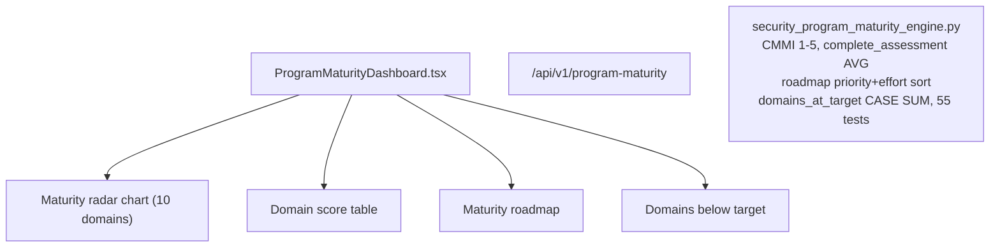

# PRD — Community 245: Security Program Maturity Dashboard

**Status**: DONE — Production  
**Effort**: 2 days  
**Date**: 2026-04-16

---

## Master Goal Mapping

| Dimension | Value |
|-----------|-------|
| ALDECI Goal | CMMI maturity — assess and track security program maturity across 10 domains (1-5 scale) |
| Persona | CISO, Security Architect |
| Priority | HIGH |
| Route | `/program-maturity` |
| Backend | `/api/v1/program-maturity` |

---

## Architecture Diagram

---

## Code Proof

| File | Lines | Description |
|------|-------|-------------|
| `suite-ui/aldeci-ui-new/src/pages/ProgramMaturityDashboard.tsx` | L1–2 | Program maturity dashboard |
| `suite-core/core/security_program_maturity_engine.py` | (engine) | 55 tests |

---

## Acceptance Criteria

- [x] CMMI 1-5 scale per domain
- [x] complete_assessment averages sub-domain scores
- [x] Roadmap sorted by priority + effort
- [x] domains_at_target computed via CASE SUM

---

## Status

**IMPLEMENTED** — 55 engine tests passing.
