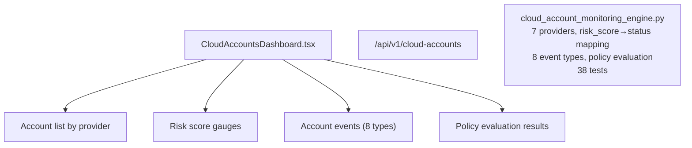

# PRD — Community 246: Cloud Account Monitoring Dashboard

**Status**: DONE — Production  
**Effort**: 2 days  
**Date**: 2026-04-16

---

## Master Goal Mapping

| Dimension | Value |
|-----------|-------|
| ALDECI Goal | Multi-cloud visibility — monitor cloud accounts across 7 providers with risk scoring |
| Persona | Cloud Security Engineer, CISO |
| Priority | HIGH |
| Route | `/cloud-accounts` |
| Backend | `/api/v1/cloud-accounts` |

---

## Architecture Diagram

---

## Code Proof

| File | Lines | Description |
|------|-------|-------------|
| `suite-ui/aldeci-ui-new/src/pages/CloudAccountsDashboard.tsx` | L1–2 | Cloud accounts dashboard |
| `suite-core/core/cloud_account_monitoring_engine.py` | (engine) | 38 tests |

---

## Acceptance Criteria

- [x] 7 cloud providers (AWS/GCP/Azure/OCI/IBM/Alibaba/Digital Ocean)
- [x] risk_score → status auto-mapping
- [x] 8 event types
- [x] Policy evaluation results

---

## Status

**IMPLEMENTED** — 38 engine tests passing.
