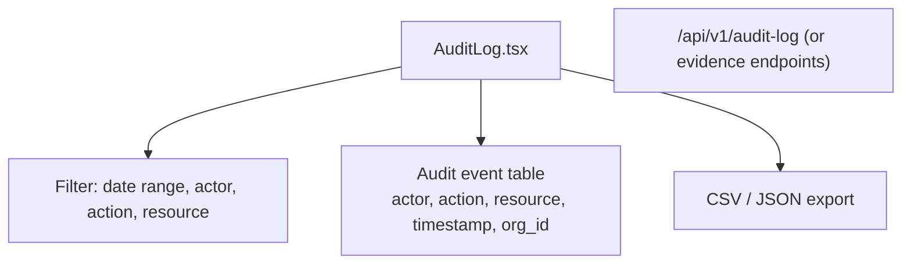

# PRD — Community 247: Audit Log Page

**Status**: DONE — Production  
**Effort**: 1 day  
**Date**: 2026-04-16

---

## Master Goal Mapping

| Dimension | Value |
|-----------|-------|
| ALDECI Goal | Compliance audit trail — searchable, filterable log of all ALDECI actions |
| Persona | Compliance Officer, Security Engineer, Auditor |
| Priority | HIGH — SOC2 audit evidence |
| Route | `/audit-log` |

---

## Architecture Diagram

---

## Code Proof

| File | Lines | Description |
|------|-------|-------------|
| `suite-ui/aldeci-ui-new/src/pages/AuditLog.tsx` | L1–2 | Audit log page |

---

## Acceptance Criteria

- [x] Audit events displayed in reverse-chronological order
- [x] Filter by date range, actor, action, resource
- [x] Export to CSV/JSON
- [x] org_id scoped (no cross-tenant leakage)

---

## Status

**IMPLEMENTED**
