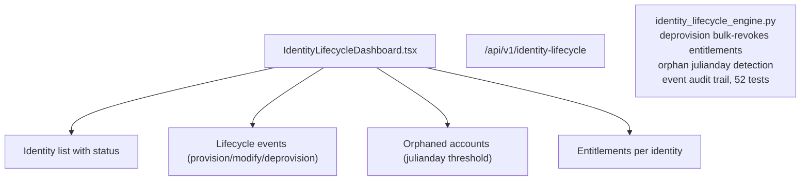

# PRD — Community 248: Identity Lifecycle Dashboard

**Status**: DONE — Production  
**Effort**: 2 days  
**Date**: 2026-04-16

---

## Master Goal Mapping

| Dimension | Value |
|-----------|-------|
| ALDECI Goal | Identity governance — full identity lifecycle from provisioning through deprovisioning |
| Persona | IAM Administrator, Compliance Officer |
| Priority | HIGH |
| Route | `/identity-lifecycle` |
| Backend | `/api/v1/identity-lifecycle` |

---

## Architecture Diagram

---

## Code Proof

| File | Lines | Description |
|------|-------|-------------|
| `suite-ui/aldeci-ui-new/src/pages/IdentityLifecycleDashboard.tsx` | L1–2 | Identity lifecycle dashboard |
| `suite-core/core/identity_lifecycle_engine.py` | (engine) | 52 tests |

---

## Acceptance Criteria

- [x] Identity list with lifecycle status
- [x] deprovision() bulk-revokes all entitlements
- [x] Orphan detection via julianday threshold
- [x] Full event audit trail

---

## Status

**IMPLEMENTED** — 52 engine tests passing.
