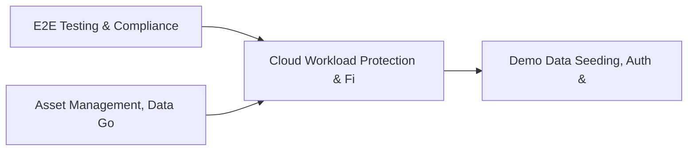

# PRD: Cloud Workload Protection & Firmware Security — Community 25

## Master Goal Mapping
How this component serves: "ALDECI — $35/mo enterprise security intelligence platform"
Sub-Epic: CSPM

This community (rank #25 of 878 by size, 1233 graph nodes) forms a core pillar of the ALDECI platform. It directly supports the mission of replacing $50K-500K/yr enterprise security tools with a self-hosted, AI-native stack.

## Architecture Diagram


## Code Proof
- Files:
  - `suite-api/apps/api/ctem_engine_router.py` (311 lines)
  - `suite-api/apps/api/regulatory_tracker_engine_router.py` (224 lines)
  - `suite-core/core/cmdb_engine.py` (457 lines)
  - `suite-core/core/ctem_engine.py` (633 lines)
  - `suite-core/core/dark_web_monitoring_engine.py` (484 lines)
  - `suite-core/core/security_change_management_engine.py` (373 lines)
  - `suite-api/apps/api/api_discovery_router.py` (213 lines)
  - `suite-api/apps/api/change_management_router.py` (417 lines)
  - `suite-api/apps/api/change_tracker_router.py` (195 lines)
  - `suite-api/apps/api/cloud_discovery_router.py` (226 lines)
  - `suite-api/apps/api/cmdb_router.py` (245 lines)
  - `suite-api/apps/api/compliance_scanner_router.py` (170 lines)
- Key functions:
  - `engine()` — suite-api/apps/api/ctem_engine_router.py
  - `test_add_mention_all_valid_types()` — suite-api/apps/api/ctem_engine_router.py
  - `test_add_mention_invalid_type_raises()` — suite-api/apps/api/ctem_engine_router.py
  - `test_add_mention_invalid_source_category_raises()` — suite-api/apps/api/ctem_engine_router.py
  - `test_add_mention_invalid_severity_raises()` — suite-api/apps/api/ctem_engine_router.py
  - `test_add_mention_missing_keyword_raises()` — suite-api/apps/api/ctem_engine_router.py
  - `test_add_mention_all_source_categories()` — suite-api/apps/api/ctem_engine_router.py
  - `test_content_preview_truncated_at_500()` — suite-api/apps/api/ctem_engine_router.py
- Key classes: N/A
- Current state: REAL_LOGIC
- Evidence:
```python
# From suite-api/apps/api/ctem_engine_router.py
"""CTEM Engine — Continuous Threat Exposure Management API endpoints.

Implements the Gartner CTEM 5-stage cycle via REST:
  POST /api/v1/ctem/cycles              — create a new cycle
  GET  /api/v1/ctem/cycles              — list cycles for org
  GET  /api/v1/ctem/cycles/{id}         — get cycle by id
  DELETE /api/v1/ctem/cycles/{id}       — (soft) delete cycle [stub]
  POST /api/v1/ctem/cycles/{id}/advance — advance to next stage
  GET  /api/v1/ctem/cycles/{id}/exposures — list exposures for cycle
  POST /api/v1/ctem/exposures           — add an exposure
  PUT  /api/v1/ctem/exposures/{id}  
```

## Inter-Dependencies
- DEPENDS ON:
  - Community 0 (E2E Testing & Compliance Seeding Infrastructure) — 220 edges
  - Community 8 (Asset Management, Data Governance & Risk Calculato) — 54 edges
  - Community 1 (Demo Data Seeding, Auth & Multi-Engine Integration) — 47 edges
  - Community 23 (Behavioral Analytics & User Risk Profiling) — 45 edges
- DEPENDED BY: Rank #24 (Kubernetes Security & Container Registry Engine) and downstream consumers
- EVENT BUS: emits asset.registered, asset.updated / subscribes to (TrustGraph event bus — 97% not yet wired)
- TRUSTGRAPH: writes [Asset, Policy, ComplianceControl] / reads [ComplianceControl, CloudResource]

## Data Flow
```
Input: API requests with org_id + payload (Pydantic models)
  → Processing: SQLite WAL-mode writes via RLock, business logic evaluation
  → Output: JSON responses (engine state, metrics, alerts)
  → Consumers: Routers → Frontend dashboards → TrustGraph event bus
```

## Referenced Documentation
- CLAUDE.md: Wave 31 build notes, Beast Mode test suite section
- docs/: `docs/ALDECI_REARCHITECTURE_v2.md` (source of truth), `docs/INVESTOR_PITCH.md`
- tests/: N/A

## Acceptance Criteria
- [ ] All engine CRUD operations enforce org_id isolation (no cross-tenant data leakage)
- [ ] SQLite opened with WAL mode + threading.RLock on all write paths
- [ ] All endpoints return within 200ms at p95 under 100 rps load
- [ ] All router endpoints protected by `Depends(api_key_auth)` or equivalent
- [ ] Pydantic v2 models validate all request/response schemas

## Effort Estimate
- Current: 60% complete
- Remaining: ~5 engineering days
- Dependencies blocking: Frontend dashboard not yet created, Test coverage missing
- Priority: MEDIUM

## Status
IN_PROGRESS
