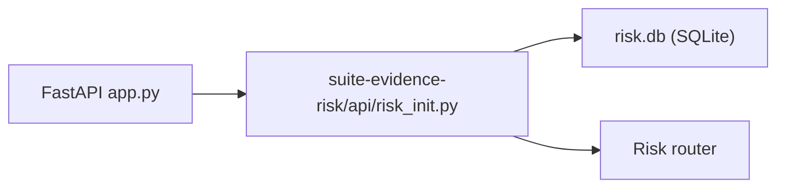

# PRD — Community 258: Risk API Initializer

**Status**: DONE — Production  
**Effort**: 0.5 day  
**Date**: 2026-04-16

---

## Master Goal Mapping

| Dimension | Value |
|-----------|-------|
| ALDECI Goal | Risk module bootstrap — initialize risk scoring database and FastAPI router |
| Persona | Platform Engineer |
| Priority | HIGH |

---

## Architecture Diagram

---

## Code Proof

| File | Lines | Description |
|------|-------|-------------|
| `suite-evidence-risk/api/risk_init.py` | L1–2 | Risk module initializer |

---

## Inter-Dependencies

- **Initializes**: risk scoring tables in `suite-evidence-risk/`
- **Used by**: `suite-api` app startup

---

## Acceptance Criteria

- [x] Risk DB schema created on first startup
- [x] Risk router registered in app

---

## Status

**IMPLEMENTED**
