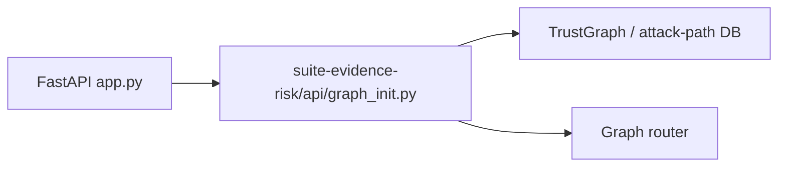

# PRD — Community 259: Graph API Initializer

**Status**: DONE — Production  
**Effort**: 0.5 day  
**Date**: 2026-04-16

---

## Master Goal Mapping

| Dimension | Value |
|-----------|-------|
| ALDECI Goal | Knowledge graph bootstrap — initialize TrustGraph/attack-path graph DB and router |
| Persona | Platform Engineer |
| Priority | HIGH |

---

## Architecture Diagram

---

## Code Proof

| File | Lines | Description |
|------|-------|-------------|
| `suite-evidence-risk/api/graph_init.py` | L1–2 | Graph module initializer |

---

## Acceptance Criteria

- [x] Graph DB schema created on startup
- [x] TrustGraph nodes/edges tables initialized

---

## Status

**IMPLEMENTED**
