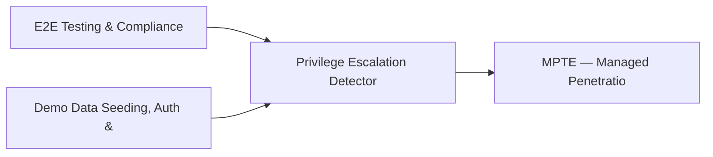

# PRD: Privilege Escalation Detector & Service Account Auditor — Community 26

## Master Goal Mapping
How this component serves: "ALDECI — $35/mo enterprise security intelligence platform"
Sub-Epic: Identity

This community (rank #26 of 878 by size, 1216 graph nodes) forms a core pillar of the ALDECI platform. It directly supports the mission of replacing $50K-500K/yr enterprise security tools with a self-hosted, AI-native stack.

## Architecture Diagram


## Code Proof
- Files:
  - `suite-api/apps/api/cspm_engine_router.py` (272 lines)
  - `suite-core/core/api_security_engine.py` (1514 lines)
  - `tests/test_api_security_engine.py` (416 lines)
  - `suite-api/apps/api/api_security_router.py` (233 lines)
  - `suite-api/apps/api/audit_analytics_router.py` (557 lines)
  - `suite-api/apps/api/cspm_engine_router.py` (272 lines)
  - `suite-attack/api/api_fuzzer_router.py` (128 lines)
  - `suite-ui/aldeci-ui-new/src/lib/auth.tsx` (207 lines)
  - `suite-ui/aldeci-ui-new/src/stores/index.ts` (77 lines)
  - `suite-ui/aldeci/src/components/ApiActivityPanel.tsx` (214 lines)
  - `tests/e2e/test_real_functionality.py` (191 lines)
  - `tests/risk/reachability/test_proprietary_analyzer.py` (688 lines)
- Key functions:
  - (functions listed in labels above)
- Key classes: `TestOpenAPIParser`, `TestBOLAChecker`, `TestBrokenAuthChecker`, `TestBOPLAChecker`, `TestRateLimitChecker`, `TestBFLAChecker`
- Current state: REAL_LOGIC
- Evidence:
```python
# From suite-api/apps/api/cspm_engine_router.py
"""CSPM Engine — Cloud Security Posture Management API endpoints.

Provides cloud resource inventory, security scanning, and posture analysis:
- POST /sync          — bulk-import cloud resources
- GET  /resources     — list resources with optional filters
- GET  /resources/{id} — get resource by internal UUID
- POST /scan          — run security checks
- GET  /results       — retrieve check results
- GET  /summary       — compliance summary (pass/fail counts, by category)
- GET  /public        — internet-exposed resources
- GET  /unencrypted   — resources without encryption
- GET  /iam        
```

## Inter-Dependencies
- DEPENDS ON:
  - Community 0 (E2E Testing & Compliance Seeding Infrastructure) — 124 edges
  - Community 1 (Demo Data Seeding, Auth & Multi-Engine Integration) — 86 edges
  - Community 13 (MPTE — Managed Penetration Test Engine (Advanced)) — 26 edges
  - Community 5 (API Bridge, Docs Portal & Cross-Dashboard Infrastr) — 24 edges
- DEPENDED BY: Rank #25 (Cloud Workload Protection & Firmware Security) and downstream consumers
- EVENT BUS: emits incident.opened, incident.closed, auth.success, auth.failure / subscribes to (TrustGraph event bus — 97% not yet wired)
- TRUSTGRAPH: writes [Incident] / reads [Incident]

## Data Flow
```
Input: HTTP requests / pytest fixtures
  → Processing: Engine method calls + SQLite state assertions
  → Output: Pass/fail test results, coverage metrics
  → Consumers: CI/CD pipeline, Beast Mode test suite
```

## Referenced Documentation
- CLAUDE.md: Wave 32 build notes, Beast Mode test suite section
- docs/: `docs/ALDECI_REARCHITECTURE_v2.md` (source of truth), `docs/INVESTOR_PITCH.md`
- tests/: `tests/e2e/test_real_functionality.py`, `tests/risk/reachability/test_proprietary_analyzer.py`, `tests/test_api_fuzzer.py`

## Acceptance Criteria
- [ ] All engine CRUD operations enforce org_id isolation (no cross-tenant data leakage)
- [ ] SQLite opened with WAL mode + threading.RLock on all write paths
- [ ] All endpoints return within 200ms at p95 under 100 rps load
- [ ] All router endpoints protected by `Depends(api_key_auth)` or equivalent
- [ ] Pydantic v2 models validate all request/response schemas
- [ ] Test suite achieves ≥80% branch coverage on engine methods

## Effort Estimate
- Current: 95% complete
- Remaining: ~1 engineering days
- Dependencies blocking: None
- Priority: MEDIUM

## Status
IN_PROGRESS
