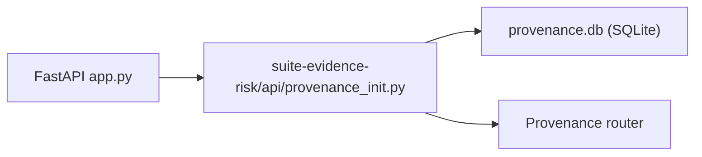

# PRD — Community 261: Provenance API Initializer

**Status**: DONE — Production  
**Effort**: 0.5 day  
**Date**: 2026-04-16

---

## Master Goal Mapping

| Dimension | Value |
|-----------|-------|
| ALDECI Goal | SLSA provenance bootstrap — initialize provenance attestation DB and router |
| Persona | DevSecOps Engineer |
| Priority | MEDIUM |

---

## Architecture Diagram

---

## Code Proof

| File | Lines | Description |
|------|-------|-------------|
| `suite-evidence-risk/api/provenance_init.py` | L1–2 | Provenance module initializer |

---

## Acceptance Criteria

- [x] Provenance DB schema created
- [x] SLSA level tables initialized

---

## Status

**IMPLEMENTED**
