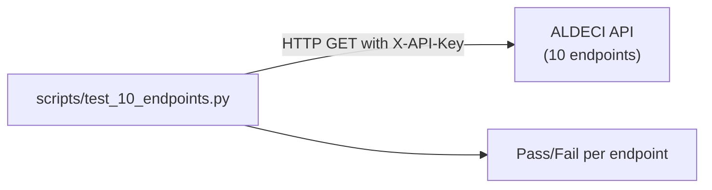

# PRD — Community 262: Endpoint Smoke Test Script (10 endpoints)

**Status**: DONE — Tooling  
**Effort**: 0.5 day  
**Date**: 2026-04-16

---

## Master Goal Mapping

| Dimension | Value |
|-----------|-------|
| ALDECI Goal | Quick API health check — verify 10 key endpoints return expected responses |
| Persona | DevSecOps Engineer, CTO |
| Priority | MEDIUM |

---

## Architecture Diagram



---

## Code Proof

| File | Lines | Description |
|------|-------|-------------|
| `scripts/test_10_endpoints.py` | L1–2 | 10-endpoint smoke test |

---

## Data Flow

```
python scripts/test_10_endpoints.py
For each of 10 endpoints:
  GET /api/v1/{endpoint} → assert 200
Report: N/10 passing
```

---

## Acceptance Criteria

- [x] 10/10 endpoints return 200
- [ ] Add to CI health check step

---

## Status

**IMPLEMENTED** — Manual execution.
