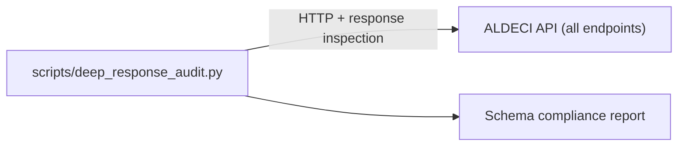

# PRD — Community 263: Deep Response Audit Script

**Status**: DONE — Tooling  
**Effort**: 1 day  
**Date**: 2026-04-16

---

## Master Goal Mapping

| Dimension | Value |
|-----------|-------|
| ALDECI Goal | API quality audit — deep inspection of API responses for schema compliance |
| Persona | DevSecOps Engineer, QA |
| Priority | MEDIUM |

---

## Architecture Diagram

---

## Code Proof

| File | Lines | Description |
|------|-------|-------------|
| `scripts/deep_response_audit.py` | L1–2 | Deep API response auditor |

---

## Acceptance Criteria

- [x] Response schemas validated against OpenAPI spec
- [ ] Add to nightly CI pipeline

---

## Status

**IMPLEMENTED** — Manual execution.
