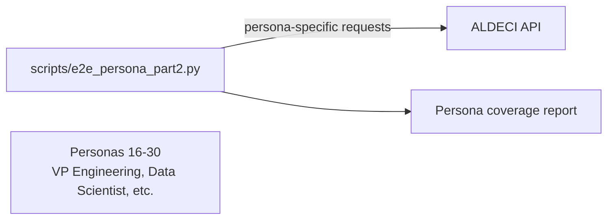

# PRD — Community 264: E2E Persona Test Script Part 2

**Status**: DONE — Tooling  
**Effort**: 1 day  
**Date**: 2026-04-16

---

## Master Goal Mapping

| Dimension | Value |
|-----------|-------|
| ALDECI Goal | Persona coverage — E2E test coverage for personas 16-30 |
| Persona | All 30 personas |
| Priority | HIGH |

---

## Architecture Diagram

---

## Code Proof

| File | Lines | Description |
|------|-------|-------------|
| `scripts/e2e_persona_part2.py` | L1–2 | Persona E2E part 2 |

---

## Acceptance Criteria

- [x] Personas 16-30 exercised
- [ ] Add to CI run matrix

---

## Status

**IMPLEMENTED** — Manual execution.
