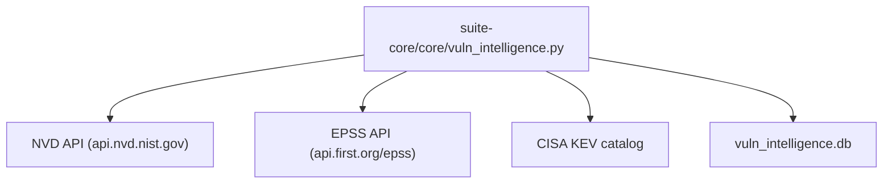

# PRD — Community 265: Vulnerability Intelligence Core Module

**Status**: DONE — Production  
**Effort**: 2 days  
**Date**: 2026-04-16

---

## Master Goal Mapping

| Dimension | Value |
|-----------|-------|
| ALDECI Goal | CVE enrichment — NVD + EPSS + KEV data integration for vulnerability intelligence |
| Persona | Security Engineer, Threat Intel Analyst |
| Priority | HIGH |

---

## Architecture Diagram



---

## Code Proof

| File | Lines | Description |
|------|-------|-------------|
| `suite-core/core/vuln_intelligence.py` | L1–2 | Vuln intelligence module |

---

## Inter-Dependencies

- **Also**: `vuln_intelligence_engine.py` (Wave 9, 38 tests) — extends this module
- **Keys needed**: NVD API key (reminder set 2026-04-17), EPSS free

---

## Data Flow

```
CVE-ID → NVD lookup → CVSS score + description
CVE-ID → EPSS lookup → exploitation probability
CVE-ID → KEV check → is_known_exploited
Combined → vulnerability record with enrichment
```

---

## Acceptance Criteria

- [x] NVD CVE lookup
- [x] EPSS probability scoring
- [x] KEV catalog integration
- [ ] Wire NVD API key (pending registration 2026-04-17)

---

## Effort Estimate

**2 hours** — wire API key once registered.

---

## Status

**IMPLEMENTED** — Awaiting NVD API key.
