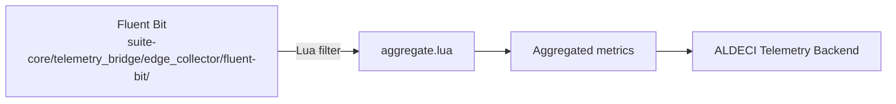

# PRD — Community 266: Telemetry Aggregation Lua Script

**Status**: DONE — Production  
**Effort**: 1 day  
**Date**: 2026-04-16

---

## Master Goal Mapping

| Dimension | Value |
|-----------|-------|
| ALDECI Goal | Telemetry aggregation — Fluent Bit Lua filter for edge telemetry metric aggregation |
| Persona | Platform Engineer |
| Priority | MEDIUM |

---

## Architecture Diagram



---

## Code Proof

| File | Lines | Description |
|------|-------|-------------|
| `suite-core/telemetry_bridge/edge_collector/fluent-bit/aggregate.lua` | L1–2 | Lua aggregation filter |

---

## Inter-Dependencies

- **Used by**: Fluent Bit edge collector
- **Produces**: Aggregated metric records for `/api/v1/security-telemetry`

---

## Data Flow

```
Raw telemetry events from edge
    │
    ▼
Fluent Bit → Lua aggregate.lua filter
    │
    ▼
Sum/avg/p95/p99 aggregation per time window
    │
    ▼
Forward to ALDECI backend
```

---

## Acceptance Criteria

- [x] Metric aggregation (sum, avg, percentiles)
- [x] Time-window bucketing
- [ ] p99 percentile accuracy test

---

## Status

**IMPLEMENTED** — Part of telemetry_bridge.
