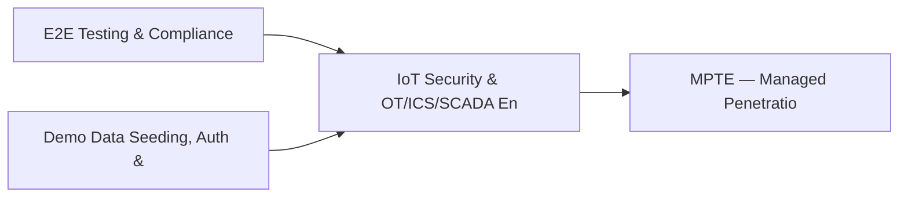

# PRD: IoT Security & OT/ICS/SCADA Engine — Community 27

## Master Goal Mapping
How this component serves: "ALDECI — $35/mo enterprise security intelligence platform"
Sub-Epic: Network

This community (rank #27 of 878 by size, 1202 graph nodes) forms a core pillar of the ALDECI platform. It directly supports the mission of replacing $50K-500K/yr enterprise security tools with a self-hosted, AI-native stack.

## Architecture Diagram


## Code Proof
- Files:
  - `suite-core/core/mfa_management_engine.py` (398 lines)
  - `suite-core/core/security_awareness_gamification_engine.py` (434 lines)
  - `suite-core/core/security_awareness_program_engine.py` (494 lines)
  - `suite-core/core/security_champions_engine.py` (501 lines)
  - `suite-core/core/security_maturity_engine.py` (540 lines)
  - `suite-core/core/security_scoreboard_engine.py` (406 lines)
  - `suite-core/core/security_training_effectiveness_engine.py` (500 lines)
  - `suite-core/core/security_training_engine.py` (943 lines)
  - `suite-api/apps/api/admin_router.py` (350 lines)
  - `suite-api/apps/api/bug_bounty_router.py` (290 lines)
  - `suite-api/apps/api/endpoint_compliance_router.py` (229 lines)
  - `suite-api/apps/api/mfa_management_router.py` (175 lines)
- Key functions:
  - `db()` — suite-core/core/mfa_management_engine.py
  - `db_path()` — suite-core/core/mfa_management_engine.py
  - `engine()` — suite-core/core/mfa_management_engine.py
  - `test_compute_level_bronze()` — suite-core/core/mfa_management_engine.py
  - `test_compute_level_silver()` — suite-core/core/mfa_management_engine.py
  - `test_compute_level_gold()` — suite-core/core/mfa_management_engine.py
  - `test_compute_level_platinum()` — suite-core/core/mfa_management_engine.py
  - `test_add_champion_basic()` — suite-core/core/mfa_management_engine.py
- Key classes: `TestTrainingModuleModel`, `TestTrainingCompletionModel`, `TestBuiltinModules`, `TestModuleCRUD`, `TestCompletionRecording`, `TestCompletionRate`
- Current state: REAL_LOGIC
- Evidence:
```python
# From suite-core/core/mfa_management_engine.py
"""MFA Management Engine — ALDECI.

Manage MFA enrollments, events, and policies across multiple authentication
factor types (TOTP, SMS, email, hardware keys, push).

Compliance: NIST SP 800-63B, FIDO2/WebAuthn, PCI DSS 4.0 req 8.5
"""

from __future__ import annotations

import json
import logging
import sqlite3
import threading
import uuid
from datetime import datetime, timezone
from pathlib import Path
from typing import Any, Dict, List, Optional

try:
```

## Inter-Dependencies
- DEPENDS ON:
  - Community 0 (E2E Testing & Compliance Seeding Infrastructure) — 220 edges
  - Community 1 (Demo Data Seeding, Auth & Multi-Engine Integration) — 36 edges
  - Community 13 (MPTE — Managed Penetration Test Engine (Advanced)) — 17 edges
  - Community 49 (Microsegmentation Policy & Third-Party Vendor Engi) — 13 edges
- DEPENDED BY: Rank #26 (Privilege Escalation Detector & Service Account Auditor) and downstream consumers
- EVENT BUS: emits user.risk_changed / subscribes to (TrustGraph event bus — 97% not yet wired)
- TRUSTGRAPH: writes [Identity, ComplianceControl] / reads [Identity, ComplianceControl]

## Data Flow
```
Input: HTTP requests / pytest fixtures
  → Processing: Engine method calls + SQLite state assertions
  → Output: Pass/fail test results, coverage metrics
  → Consumers: CI/CD pipeline, Beast Mode test suite
```

## Referenced Documentation
- CLAUDE.md: Wave 33 build notes, Beast Mode test suite section
- docs/: `docs/ALDECI_REARCHITECTURE_v2.md` (source of truth), `docs/INVESTOR_PITCH.md`
- tests/: `tests/test_bug_bounty.py`

## Acceptance Criteria
- [ ] All engine CRUD operations enforce org_id isolation (no cross-tenant data leakage)
- [ ] SQLite opened with WAL mode + threading.RLock on all write paths
- [ ] All endpoints return within 200ms at p95 under 100 rps load
- [ ] All router endpoints protected by `Depends(api_key_auth)` or equivalent
- [ ] Pydantic v2 models validate all request/response schemas
- [ ] Test suite achieves ≥80% branch coverage on engine methods

## Effort Estimate
- Current: 80% complete
- Remaining: ~2 engineering days
- Dependencies blocking: Frontend dashboard not yet created
- Priority: MEDIUM

## Status
IN_PROGRESS
