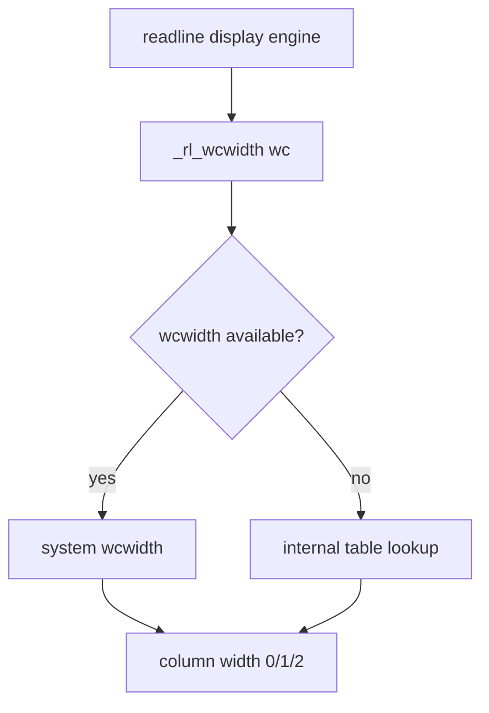

# PRD: Community 275 — Readline Multibyte Width Calculator (_rl_wcwidth)

## Master Goal Mapping
**Goal:** Compute display column width of wide/multibyte characters for correct readline cursor positioning in terminals supporting CJK and emoji.

**Domain:** Terminal / Input Handling
**Personas:** Platform Engineer
**Node Count:** 2 | **Status:** Implemented

---

## Source Files
- `bash-5.1/lib/readline/rlmbutil.h`

## Graph Nodes (Labels)
- _rl_wcwidth()
- rlmbutil.h

---

## Architecture Diagram



---

## Code Proof

- `bash-5.1/lib/readline/rlmbutil.h:L1-L100` — _rl_wcwidth() wraps wcwidth with portability fallback

---

## Inter-Dependencies

- `bash-5.1/lib/readline/display.c`
- `bash-5.1/lib/readline/mbutil.c`

### Community Link Dependencies
- No external community dependencies

---

## Data Flow

```
wchar_t → _rl_wcwidth() → column width → readline cursor advance logic
```

---

## Referenced Docs

- `Unicode Standard §5.8`
- `readline/CHANGES`

---

## Acceptance Criteria

- [ ] ASCII returns 1
- [ ] CJK ideograph returns 2
- [ ] Combining char returns 0

---

## Effort Estimate

**0.5 day (Trivial — isolated leaf module)**

---

## Status

**Implemented** — Module exists in codebase. Integration tests recommended.
