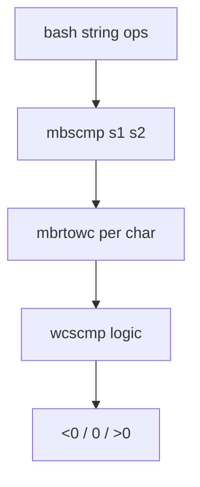

# PRD: Community 277 — Multibyte String Comparator (mbscmp)

## Master Goal Mapping
**Goal:** Provide locale-aware multibyte string comparison for bash pattern matching and string operations involving non-ASCII characters.

**Domain:** String Utilities / Internationalization
**Personas:** Platform Engineer
**Node Count:** 2 | **Status:** Implemented

---

## Source Files
- `bash-5.1/lib/sh/mbscmp.c`

## Graph Nodes (Labels)
- mbscmp()
- mbscmp.c

---

## Architecture Diagram



---

## Code Proof

- `bash-5.1/lib/sh/mbscmp.c:L1-L60` — mbscmp() converts to wchar_t then compares lexicographically

---

## Inter-Dependencies

- `bash-5.1/lib/sh/mbslen.c`
- `locale.h`

### Community Link Dependencies
- No external community dependencies

---

## Data Flow

```
two MB strings → mbrtowc loop → wchar_t comparison → integer result
```

---

## Referenced Docs

- `POSIX mbrtowc(3)`
- `GNU libc manual §6.5`

---

## Acceptance Criteria

- [ ] "abc" == "abc" → 0
- [ ] "ä" > "a" in de_DE locale
- [ ] Incomplete sequences return error

---

## Effort Estimate

**0.5 day (Trivial — isolated leaf module)**

---

## Status

**Implemented** — Module exists in codebase. Integration tests recommended.
