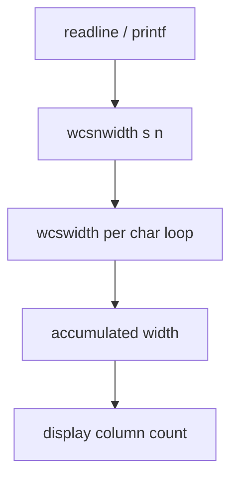

# PRD: Community 278 — Wide Character N-Width Calculator (wcsnwidth)

## Master Goal Mapping
**Goal:** Calculate display width of at most N wide characters for safe terminal output truncation in bash prompt and readline display code.

**Domain:** Terminal / String Utilities
**Personas:** Platform Engineer
**Node Count:** 2 | **Status:** Implemented

---

## Source Files
- `bash-5.1/lib/sh/wcsnwidth.c`

## Graph Nodes (Labels)
- wcsnwidth()
- wcsnwidth.c

---

## Architecture Diagram



---

## Code Proof

- `bash-5.1/lib/sh/wcsnwidth.c:L1-L50` — wcsnwidth() sums wcswidth for each wchar_t up to n chars

---

## Inter-Dependencies

- `bash-5.1/lib/sh/mbscmp.c`

### Community Link Dependencies
- No external community dependencies

---

## Data Flow

```
wchar_t* + max_chars → wcsnwidth() → total display columns
```

---

## Referenced Docs

- `Unicode Standard §9.1`
- `POSIX wcswidth(3)`

---

## Acceptance Criteria

- [ ] Pure ASCII: columns == chars
- [ ] CJK string: columns == 2*chars
- [ ] n=0 returns 0

---

## Effort Estimate

**0.5 day (Trivial — isolated leaf module)**

---

## Status

**Implemented** — Module exists in codebase. Integration tests recommended.
