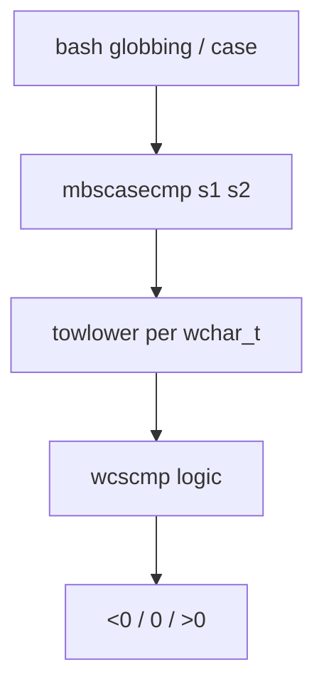

# PRD: Community 279 — Multibyte Case-Insensitive Comparator (mbscasecmp)

## Master Goal Mapping
**Goal:** Provide case-insensitive multibyte string comparison for bash case-insensitive pattern matching with proper locale support.

**Domain:** String Utilities / Internationalization
**Personas:** Platform Engineer
**Node Count:** 2 | **Status:** Implemented

---

## Source Files
- `bash-5.1/lib/sh/mbscasecmp.c`

## Graph Nodes (Labels)
- mbscasecmp()
- mbscasecmp.c

---

## Architecture Diagram



---

## Code Proof

- `bash-5.1/lib/sh/mbscasecmp.c:L1-L70` — mbscasecmp() towlower on each wchar, then compare

---

## Inter-Dependencies

- `bash-5.1/lib/sh/mbscmp.c`
- `wctype.h`

### Community Link Dependencies
- No external community dependencies

---

## Data Flow

```
two MB strings → mbrtowc + towlower loop → lexicographic compare → int
```

---

## Referenced Docs

- `POSIX towlower(3)`
- `GNU libc manual §6.1`

---

## Acceptance Criteria

- [ ] ASCII: "A" == "a"
- [ ] "ß".lower() == "ss" in de_DE
- [ ] NULL inputs return error

---

## Effort Estimate

**0.5 day (Trivial — isolated leaf module)**

---

## Status

**Implemented** — Module exists in codebase. Integration tests recommended.
