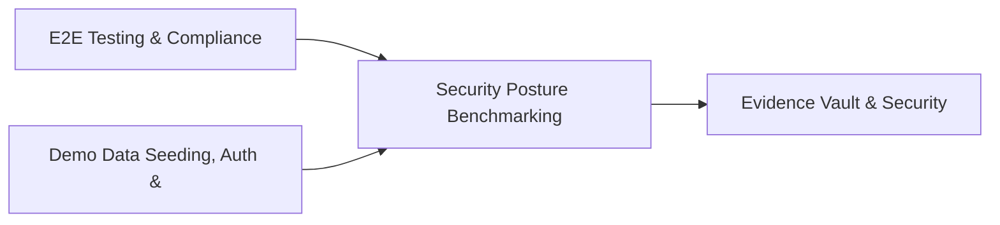

# PRD: Security Posture Benchmarking & Maturity Engine — Community 28

## Master Goal Mapping
How this component serves: "ALDECI — $35/mo enterprise security intelligence platform"
Sub-Epic: GRC

This community (rank #28 of 878 by size, 1185 graph nodes) forms a core pillar of the ALDECI platform. It directly supports the mission of replacing $50K-500K/yr enterprise security tools with a self-hosted, AI-native stack.

## Architecture Diagram


## Code Proof
- Files:
  - `suite-api/apps/api/sla_engine_router.py` (212 lines)
  - `suite-api/apps/api/workflow_engine_router.py` (219 lines)
  - `suite-core/core/passive_dns_engine.py` (424 lines)
  - `suite-core/core/sla_engine.py` (473 lines)
  - `suite-core/core/sla_escalation_engine.py` (460 lines)
  - `suite-core/core/vuln_exception_engine.py` (390 lines)
  - `suite-core/core/workflow_engine.py` (874 lines)
  - `tests/test_dlp_engine.py` (603 lines)
  - `suite-api/apps/api/notification_router.py` (199 lines)
  - `suite-api/apps/api/passive_dns_router.py` (160 lines)
  - `suite-api/apps/api/patch_automation_router.py` (263 lines)
  - `suite-api/apps/api/remediation_router.py` (997 lines)
- Key functions:
  - `engine()` — suite-api/apps/api/sla_engine_router.py
  - `make_resolution()` — suite-api/apps/api/sla_engine_router.py
  - `make_threat()` — suite-api/apps/api/sla_engine_router.py
  - `_make_posture()` — suite-api/apps/api/sla_engine_router.py
  - `_make_sla_record()` — suite-api/apps/api/sla_engine_router.py
  - `mock_posture_scorer()` — suite-api/apps/api/sla_engine_router.py
  - `mock_sla_manager()` — suite-api/apps/api/sla_engine_router.py
  - `bot()` — suite-api/apps/api/sla_engine_router.py
- Key classes: `TestInit`, `TestRecordResolution`, `TestListResolutions`, `TestDomainHistory`, `TestIPHistory`, `TestDetectFastFlux`
- Current state: REAL_LOGIC
- Evidence:
```python
# From suite-api/apps/api/sla_engine_router.py
"""
SLA Engine Router — Security Finding SLA Tracking and Breach Prevention.

Endpoints:
  POST /api/v1/sla-engine/track              — start tracking a finding
  GET  /api/v1/sla-engine/status/{finding_id} — get SLA status
  GET  /api/v1/sla-engine/at-risk            — list at-risk findings
  GET  /api/v1/sla-engine/dashboard          — SLA dashboard stats
  GET  /api/v1/sla-engine/compliance-rate    — compliance rate
  POST /api/v1/sla-engine/resolve/{finding_id} — mark finding resolved
  POST /api/v1/sla-engine/policy             — create SLA policy
  POST /api/v1/sla-engine/alerts         
```

## Inter-Dependencies
- DEPENDS ON:
  - Community 0 (E2E Testing & Compliance Seeding Infrastructure) — 258 edges
  - Community 1 (Demo Data Seeding, Auth & Multi-Engine Integration) — 47 edges
  - Community 36 (Evidence Vault & Security Service Catalog) — 38 edges
  - Community 21 (Compliance Automation & Workflow Engine) — 37 edges
- DEPENDED BY: Rank #27 (IoT Security & OT/ICS/SCADA Engine) and downstream consumers
- EVENT BUS: emits threat.detected, threat.mitigated / subscribes to (TrustGraph event bus — 97% not yet wired)
- TRUSTGRAPH: writes [Vulnerability, ThreatActor] / reads [Vulnerability, ThreatActor]

## Data Flow
```
Input: HTTP requests / pytest fixtures
  → Processing: Engine method calls + SQLite state assertions
  → Output: Pass/fail test results, coverage metrics
  → Consumers: CI/CD pipeline, Beast Mode test suite
```

## Referenced Documentation
- CLAUDE.md: Wave 34 build notes, Beast Mode test suite section
- docs/: `docs/ALDECI_REARCHITECTURE_v2.md` (source of truth), `docs/INVESTOR_PITCH.md`
- tests/: `tests/test_api_dependencies.py`, `tests/test_container_runtime.py`, `tests/test_dashboard_builder.py`

## Acceptance Criteria
- [ ] All engine CRUD operations enforce org_id isolation (no cross-tenant data leakage)
- [ ] SQLite opened with WAL mode + threading.RLock on all write paths
- [ ] All endpoints return within 200ms at p95 under 100 rps load
- [ ] All router endpoints protected by `Depends(api_key_auth)` or equivalent
- [ ] Pydantic v2 models validate all request/response schemas
- [ ] Test suite achieves ≥80% branch coverage on engine methods

## Effort Estimate
- Current: 80% complete
- Remaining: ~2 engineering days
- Dependencies blocking: Frontend dashboard not yet created
- Priority: MEDIUM

## Status
IN_PROGRESS
