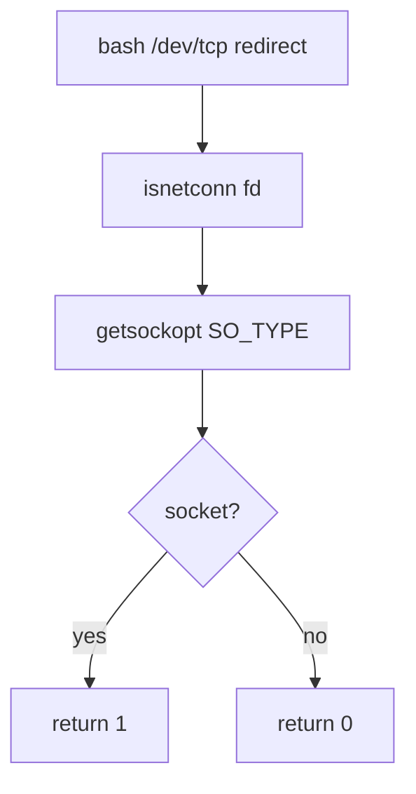

# PRD: Community 280 — Network Connection Detector (isnetconn)

## Master Goal Mapping
**Goal:** Detect whether a file descriptor is a network socket to enable bash network redirection syntax (/dev/tcp, /dev/udp) safely.

**Domain:** Network / Socket Utilities
**Personas:** Platform Engineer, DevOps Operator
**Node Count:** 2 | **Status:** Implemented

---

## Source Files
- `bash-5.1/lib/sh/netconn.c`

## Graph Nodes (Labels)
- isnetconn()
- netconn.c

---

## Architecture Diagram



---

## Code Proof

- `bash-5.1/lib/sh/netconn.c:L1-L60` — isnetconn() calls getsockopt to probe SO_TYPE on fd

---

## Inter-Dependencies

- `bash-5.1/redir.c`

### Community Link Dependencies
- No external community dependencies

---

## Data Flow

```
fd → isnetconn() → getsockopt(SO_TYPE) → bool (is network socket)
```

---

## Referenced Docs

- `POSIX getsockopt(2)`
- `bash-5.1/doc/bash.1 §REDIRECTION`

---

## Acceptance Criteria

- [ ] TCP socket fd → returns 1
- [ ] Regular file fd → returns 0
- [ ] Invalid fd → returns 0 with errno set

---

## Effort Estimate

**0.5 day (Trivial — isolated leaf module)**

---

## Status

**Implemented** — Module exists in codebase. Integration tests recommended.
