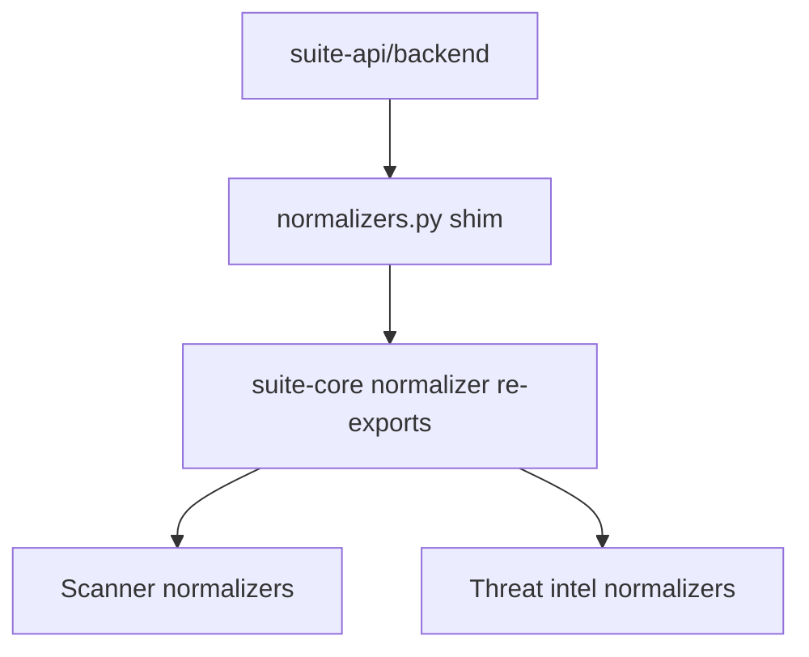

# PRD: Community 282 — API Normalizer Compatibility Shim

## Master Goal Mapping
**Goal:** Provide a compatibility layer so suite-api backend imports can reuse suite-core normalizer implementations without code duplication, enforcing DRY across the monorepo.

**Domain:** API Layer / Compatibility
**Personas:** Platform Engineer, Backend Developer
**Node Count:** 2 | **Status:** Implemented

---

## Source Files
- `suite-api/backend/normalizers.py`

## Graph Nodes (Labels)
- Compatibility shim so backend imports reuse API normalisers.
- normalizers.py

---

## Architecture Diagram



---

## Code Proof

- `suite-api/backend/normalizers.py:L1` — Compatibility shim so backend imports reuse API normalisers

---

## Inter-Dependencies

- `suite-core/core/scanner_parsers.py`
- `suite-api/apps/api/`

### Community Link Dependencies
- No external community dependencies

---

## Data Flow

```
suite-api import normalizers → shim → suite-core.scanner_parsers → normalized finding dict
```

---

## Referenced Docs

- `suite-core/core/scanner_parsers.py`
- `docs/ALDECI_REARCHITECTURE_v2.md §normalizers`

---

## Acceptance Criteria

- [ ] from backend.normalizers import X works
- [ ] No circular imports
- [ ] All 32 scanner normalizers accessible

---

## Effort Estimate

**0.5 day (Trivial — isolated leaf module)**

---

## Status

**Implemented** — Module exists in codebase. Integration tests recommended.
