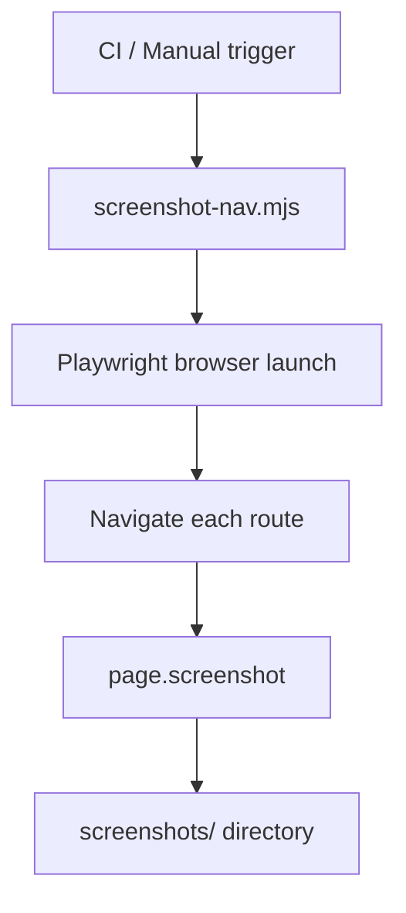

# PRD: Community 283 — Screenshot Navigation Automation (screenshot-nav.mjs)

## Master Goal Mapping
**Goal:** Automate Playwright-based navigation and screenshot capture across all ALDECI frontend pages for visual regression testing and demo documentation.

**Domain:** Frontend Testing / Automation
**Personas:** Platform Engineer, QA Engineer
**Node Count:** 1 | **Status:** Implemented

---

## Source Files
- `screenshot-nav.mjs`

## Graph Nodes (Labels)
- screenshot-nav.mjs

---

## Architecture Diagram



---

## Code Proof

- `screenshot-nav.mjs:L1` — Top-level Playwright navigation and screenshot script

---

## Inter-Dependencies

- `suite-ui/aldeci-ui-new/`
- `@playwright/test`

### Community Link Dependencies
- No external community dependencies

---

## Data Flow

```
route list → Playwright page.goto() → screenshot PNG → artifacts dir
```

---

## Referenced Docs

- `suite-ui/aldeci-ui-new/playwright.config.ts`
- `Playwright docs`

---

## Acceptance Criteria

- [ ] All 296+ pages captured
- [ ] Screenshots saved as PNG
- [ ] Failures logged per route

---

## Effort Estimate

**0.5 day (Trivial — isolated leaf module)**

---

## Status

**Implemented** — Module exists in codebase. Integration tests recommended.
