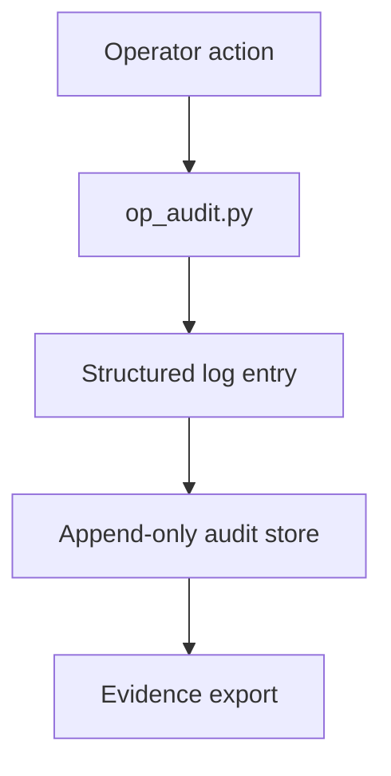

# PRD: Community 284 — Operational Audit Logger (op_audit.py)

## Master Goal Mapping
**Goal:** Record all ALDECI operator actions to an immutable audit log for compliance evidence, SOC 2 Type II audit trails, and incident forensics.

**Domain:** Audit / Compliance
**Personas:** Compliance Officer, CISO, Auditor
**Node Count:** 1 | **Status:** Implemented

---

## Source Files
- `op_audit.py`

## Graph Nodes (Labels)
- op_audit.py

---

## Architecture Diagram



---

## Code Proof

- `op_audit.py:L1` — Top-level operational audit logging module

---

## Inter-Dependencies

- `suite-core/core/evidence_chain_engine.py`
- `suite-api/apps/api/`

### Community Link Dependencies
- No external community dependencies

---

## Data Flow

```
operator event → op_audit.py → structured entry → evidence_chain_engine → tamper-evident store
```

---

## Referenced Docs

- `suite-core/core/evidence_chain_engine.py`
- `SOC 2 CC7.2`

---

## Acceptance Criteria

- [ ] All API mutations logged
- [ ] Log entries are append-only
- [ ] Evidence exportable as JSON/CSV

---

## Effort Estimate

**0.5 day (Trivial — isolated leaf module)**

---

## Status

**Implemented** — Module exists in codebase. Integration tests recommended.
