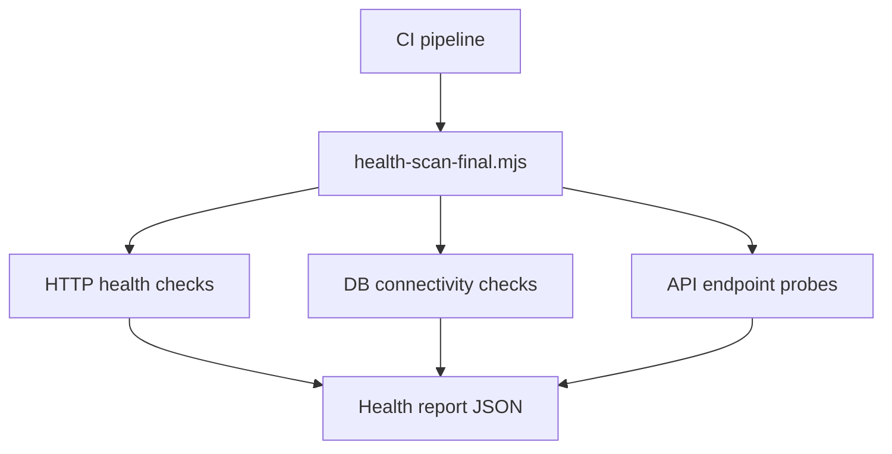

# PRD: Community 285 — Health Scan Final Report Generator (health-scan-final.mjs)

## Master Goal Mapping
**Goal:** Run comprehensive final health scan across all ALDECI services and generate a consolidated status report for pre-deployment validation gates.

**Domain:** Health Monitoring / CI
**Personas:** Platform Engineer, DevOps Operator
**Node Count:** 1 | **Status:** Implemented

---

## Source Files
- `health-scan-final.mjs`

## Graph Nodes (Labels)
- health-scan-final.mjs

---

## Architecture Diagram



---

## Code Proof

- `health-scan-final.mjs:L1` — Final health scan orchestrator

---

## Inter-Dependencies

- `serve.js`
- `suite-api/`
- `quick-check.mjs`

### Community Link Dependencies
- No external community dependencies

---

## Data Flow

```
scan trigger → parallel HTTP probes → aggregate results → pass/fail report → exit code
```

---

## Referenced Docs

- `health-scan.mjs`
- `suite-api/apps/main.py /health`

---

## Acceptance Criteria

- [ ] All critical endpoints probed
- [ ] Exit code 0 on full pass
- [ ] Report includes response times

---

## Effort Estimate

**0.5 day (Trivial — isolated leaf module)**

---

## Status

**Implemented** — Module exists in codebase. Integration tests recommended.
