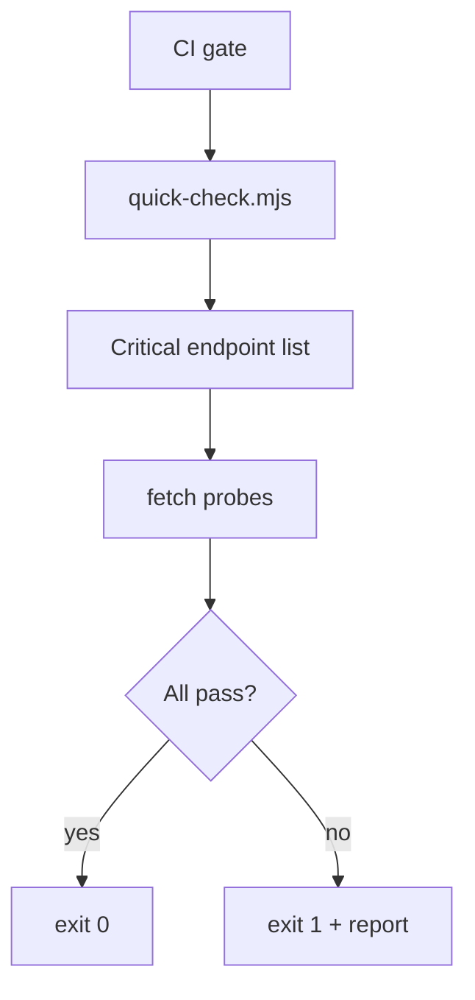

# PRD: Community 286 — Quick Health Check (quick-check.mjs)

## Master Goal Mapping
**Goal:** Perform a fast subset health check of the most critical ALDECI endpoints for rapid CI gate validation without full scan overhead.

**Domain:** Health Monitoring / CI
**Personas:** Platform Engineer, DevOps Operator
**Node Count:** 1 | **Status:** Implemented

---

## Source Files
- `quick-check.mjs`

## Graph Nodes (Labels)
- quick-check.mjs

---

## Architecture Diagram



---

## Code Proof

- `quick-check.mjs:L1` — Fast health check for critical endpoints only

---

## Inter-Dependencies

- `suite-api/apps/main.py`
- `health-scan-final.mjs`

### Community Link Dependencies
- No external community dependencies

---

## Data Flow

```
critical endpoint list → parallel fetch → status codes → pass/fail → exit code
```

---

## Referenced Docs

- `health-scan-final.mjs`
- `suite-api/apps/main.py`

---

## Acceptance Criteria

- [ ] Completes in <10s
- [ ] Checks /health and /api/v1/status
- [ ] Non-zero exit on any failure

---

## Effort Estimate

**0.5 day (Trivial — isolated leaf module)**

---

## Status

**Implemented** — Module exists in codebase. Integration tests recommended.
